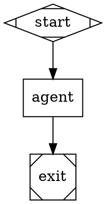

# Kilroy

Local-first CLI that runs AI coding workflows in a git repo. Each workflow is a self-contained package (`workflow.toml` + DOT graph + prompts) that resolves provider, model, backend, and credentials automatically from a *class* (e.g. `hard_coding`, `deep_investigation`), then freezes the choice in a prelaunch snapshot before any LLM call.

**Status: alpha.** Public surface is `kilroy run <workflow>`. Auth setup requires shell env vars; a `kilroy auth set` write surface is on the post-alpha roadmap.

## Install

```bash
brew install danshapiro/kilroy/kilroy        # macOS / Linux
# or
go install github.com/danshapiro/kilroy/cmd/kilroy@latest
# or
go build -o ./kilroy ./cmd/kilroy/
```

## Quick start

```bash
kilroy auth init            # generate ~/.config/kilroy/auth.toml from detected env vars
kilroy auth check           # verify every chain has a usable source
kilroy workflows list       # show shipped workflow packages
kilroy workflows validate implement   # confirm this would launch on this machine

kilroy run implement --input-file prompt=spec.md --label scope=my-task
kilroy runs list --pretty
kilroy runs show <run-id>
```

Run output, artifacts, and isolated execution worktree all land under `~/.local/state/kilroy/attractor/runs/<run-id>/`.

`kilroy run` is **async by default** — it returns immediately with a run handle. Pass `--sync` to block until the run terminates.

## Concepts

**Workflow package.** A directory under `workflows/<name>/` (or `~/.config/kilroy/workflows/<name>/`) with `workflow.toml`, `graph.dot`, and optional `prompts/` + `scripts/`. The CLI discovers them via `KILROY_WORKFLOW_PATHS`, project-root `.kilroy/workflows/`, and XDG config dir, in that order.

**Agent class.** Each stage declares a class (`hard_coding`, `deep_investigation`, `architectural_critique`, `quick_easy`, etc.) instead of a model. The class resolver maps the class to a `(provider, model, driver)` tuple via the policy chain at prelaunch — and the choice is **frozen**. Execution does not re-resolve. See `kilroy policy list` for the available classes and how each resolves on this machine.

**Auth chain.** Each `(provider, method)` binding is satisfied by an ordered chain of credential sources (env var → CLI session → keychain). Convention: per-tool budgets use `<PROVIDER>_API_KEY_KILROY` — when set, that key beats the canonical key without unsetting it.

**Validation = launch parity.** `kilroy workflows validate <name>` runs the same prelaunch checks `kilroy run` does (graph integrity, class resolution, auth resolution, CLI binary probes, credential probes). If validate passes, launch will not silently fail on these axes.

## Shipped workflows

| Workflow | What it does |
|---|---|
| `implement` | Single-shot directed change with build+test verification, retries the agent once on verify fail |
| `fix` | Bug fix from a reproduction; smallest reasonable change |
| `investigate` | Read-only research — gathers context, reads URLs, returns a structured artifact |
| `review` | Reviews a diff against a goal, returns a structured review |
| `coding-relay` | Iterative planner→coder→critic→status loop, up to 6 iterations; right for multi-step refactors |
| `coding-loop` | Lightweight code-then-review loop with the `quick_easy` class as default |
| `multi-tool-exercise` | Exercises tool dispatch across drivers; integration shape |
| `build-test` | Runs build+test in a worktree; useful as a child pipeline |

Run `kilroy workflows describe <name> --pretty` for inputs/outputs and the default class.

## Watching, waiting, and reading runs

```bash
# Tag at launch — labels are queryable later.
kilroy run implement --input-file prompt=spec.md --label scope=auth --label issue=42

# Live snapshot of the most recent run.
kilroy status --latest --watch

# Block until terminal status (success/fail/canceled).
kilroy runs wait <run-id> --timeout 1h

# Filter runs by tag.
kilroy runs list --label scope=auth --pretty

# Inspect a finished run (artifacts on disk, summary printed).
kilroy runs show <run-id>
```

The run's `worktree/` is an isolated git checkout — agent commits land on the run branch (`attractor/run/<run-id>`) and are picked into your working branch by hand or via `git cherry-pick`.

## Authoring a workflow

Minimal package layout:

```
workflows/myflow/
├── workflow.toml
├── graph.dot
└── prompts/                  # optional
```

Minimal `workflow.toml`:

```toml
[workflow]
name              = "myflow"
version           = "1"
description       = "What this does."
default_class     = "hard_coding"
graph             = "graph.dot"

[inputs.prompt]
type        = "string"
required    = true
description = "What to do."

[nodes.agent]
class = "hard_coding"
```

Minimal `graph.dot` (declare class on agent nodes, never raw `llm_model`):



Validate with `kilroy workflows validate myflow --pretty` before launching. Models are not specified directly; the policy class resolver picks the model based on the class. Add a class to `internal/policy/data/policy.toml` if you need a routing shape that doesn't yet exist.

## Supported providers

API and CLI: `openai`, `anthropic`, `google`. API only: `kimi`, `zai`, `cerebras`, `minimax`, `inception`. Provider aliases: `gemini`/`google_ai_studio` → `google`, `moonshot` → `kimi`, `z-ai` → `zai`. CLI tools (`claude`, `codex`, `gemini`, `opencode`) reuse your logged-in subscription; API providers use `<PROVIDER>_API_KEY` (or `<PROVIDER>_API_KEY_KILROY` for kilroy-scoped budgets).

## Commands

```text
kilroy run <workflow>           [--input-file KEY=PATH ...] [--label K=V ...] [--sync] [--pretty]
kilroy workflows                list | describe <name> | validate <name>
kilroy runs                     list | show <id> | wait <id> | prune
kilroy status                   [--logs-root <dir> | --latest] [--watch]
kilroy resume                   --logs-root <dir>
kilroy stop                     --logs-root <dir> [--grace-ms <ms>] [--force]
kilroy auth                     defaults | init | list | check | suggest-fix
kilroy policy                   list | show <class> | resolve <class> | explain <run-id>
kilroy ingest                   [--output <file.dot>] <requirements>
```

Exit codes: `0` = success or validation pass; `1` = failure or non-success terminal status.

## Run artifacts

Per-run under `<logs_root>`: `graph.dot`, `prelaunch_validation.json`, `manifest.json`, `final.json`, `run_config.json`, `run.tgz`, isolated `worktree/`.

Per-stage under `<logs_root>/<node_id>/`: `prompt.md`, `response.md`, `status.json`, `resolution.json`, plus `events.ndjson` (API path) or `agent_output.jsonl` + `cli_invocation.json` (CLI path).

## Alpha caveats

- **Auth setup is read-only today.** `auth init` generates a config from detected env vars; updates require editing `~/.config/kilroy/auth.toml` or shell exports. A `kilroy auth set/login` write surface is planned post-alpha.
- **Some legacy direct-mode flags** (`--graph`, `--package`, `--config`, `--run-id`, `--logs-root`) are kept for ad-hoc work and tests. The recommended public surface is `kilroy run <workflow>`.
- **Stale-build detection** for dev builds: `kilroy run` refuses to launch a binary older than the source tree. Rebuild or pass `--confirm-stale-build`.

## License

MIT. See `LICENSE`.
