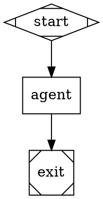

# Kilroy

Local-first CLI that runs AI coding workflows in a git repo. Each workflow is a self-contained package (`workflow.toml` + DOT graph + prompts) that resolves provider, model, backend, and credentials automatically from a *class* (e.g. `hard_coding`, `deep_investigation`), then freezes the choice in a prelaunch snapshot before any LLM call.

**Status: alpha.** Public surface is `kilroy run <workflow>`. See
[`docs/usage.md`](docs/usage.md) for the agent-worker usage guide. Auth setup
uses detected env vars and CLI sessions; `kilroy auth set/prefer/remove-source`
manage env-var mappings without storing key values.

## Prerequisites

Kilroy is alpha and built from source today. Before installing:

- **Go ≥ 1.25** to build the binary (see `go.mod`).
- **tmux** — required by every CLI-agent driver (`claude_cli`, `codex_cli`,
  `gemini_cli`, `opencode`). Without tmux, only the SDK/API drivers work.
  Install via your package manager.
- **At least one coding agent**, in either form:
  - A logged-in CLI agent — recommended is the Claude Code CLI
    ([install guide](https://docs.claude.com/claude-code)). `codex`, `gemini`,
    and `opencode` are also supported.
  - **and/or** a provider API key in env (`ANTHROPIC_API_KEY`, `OPENAI_API_KEY`,
    `GEMINI_API_KEY`, `KIMI_API_KEY`, …). Prefer `<PROVIDER>_API_KEY_KILROY`
    to scope Kilroy spend separately from your daily CLI use.
- **A git repo** to run in. Workflows write into an isolated worktree per run.

**Platform support:** macOS and Linux. Windows is supported via WSL2 only —
the installer is a bash script that builds Go, copies into `~/.local/bin`, and
symlinks skills into agent skill roots.

## Install

From a checkout of this repo:

```bash
git clone https://github.com/danshapiro/kilroy.git
cd kilroy
./scripts/install.sh
```

The installer:

- builds `kilroy` and copies it to `~/.local/bin/kilroy`
- refreshes built-in workflows under `$XDG_DATA_HOME/kilroy/workflows`
- symlinks first-party agent skills (`using-kilroy`, `create-dotfile`,
  `create-runfile`, `build-dod`, `investigating-kilroy-runs`,
  `starting-a-project`, `release-kilroy`) into `~/.claude/skills`,
  `~/.codex/skills`, `~/.agents/skills`, `~/.config/opencode/skills`

Add `~/.local/bin` to your `PATH` if it isn't already. Re-run
`./scripts/install.sh` after `git pull` to refresh the binary, workflows, and
skills.

## Quick start

```bash
kilroy auth init            # generate ~/.config/kilroy/auth.toml from detected env vars / CLI sessions
kilroy auth check           # verify every chain has a usable source
kilroy list                 # show the three shipped demo workflows (plan / implement / validate)
kilroy check implement      # confirm this would launch on this machine
```

The default factory line is `plan` → `implement` → `validate`:

```bash
# 1. Turn a goal into a task packet, testing plan, and validation plan.
echo "Add a dark-mode toggle to the settings page." > /tmp/goal.md
kilroy run plan --input-file goal=/tmp/goal.md --label session=demo --sync

# 2. Run the planner/coder/critic loop against the packet.
kilroy run implement \
  --input-file task_packet=task-packet.md \
  --input-file testing_plan=testing-plan.md \
  --input-file validation_plan=validation-plan.md \
  --label session=demo

# 3. Collect evidence against the validation plan.
kilroy run validate \
  --input-file task_packet=task-packet.md \
  --input-file validation_plan=validation-plan.md \
  --input-file validation_command=validation-command.txt \
  --label session=demo

kilroy runs list --pretty
kilroy runs show <run-id>
```

Run output, artifacts, and the isolated execution worktree all land under
`~/.local/state/kilroy/attractor/runs/<run-id>/`.

`kilroy run` is **async by default**. It validates first, then returns a JSON
run handle with `prelaunch` details. Pass `--sync` to block until the run
terminates.

The `using-kilroy` skill (installed by `scripts/install.sh`) drives this loop
end-to-end from an agent like Claude Code — say "use Kilroy to add a dark-mode
toggle" and the skill will run `plan` → `implement` → `validate` for you.

## Local UI

Kilroy's dashboard is a peripheral developer UI, not served by `kilroy`: run it
with `go run ./ui/server --addr 127.0.0.1:8080` or build it with
`go build -o ./kilroy-ui ./ui/server`. It reads Kilroy's default run database
directly and exposes dense run history, logs, outputs, policy/auth context, and
manual maintenance actions for zombie or stale runs.

## Concepts

**Workflow package.** A directory with `workflow.toml`, `graph.dot`, and
optional `prompts/` + `scripts/`. The CLI discovers workflows via
`KILROY_WORKFLOW_PATHS`, project-root `.kilroy/workflows/`, XDG config/data
dirs, and the source-checkout fallback for development binaries, in that order.

**Agent class.** Each stage declares a class (`hard_coding`, `deep_investigation`, `architectural_critique`, `quick_easy`, etc.) instead of a model. The class resolver maps the class to a `(provider, model, driver)` tuple via the policy chain at prelaunch — and the choice is **frozen**. Execution does not re-resolve. See `kilroy policy list` for the available classes and how each resolves on this machine.

**Auth chain.** Each `(provider, method)` binding is satisfied by an ordered chain of credential sources (env var or CLI session). Convention: per-tool budgets use `<PROVIDER>_API_KEY_KILROY` — when set, that key beats the canonical key without unsetting it.

**Validation = launch parity.** `kilroy check <name>` runs the same prelaunch checks `kilroy run` does (graph integrity, class resolution, auth resolution, CLI binary probes, credential probes). If check passes, launch will not silently fail on these axes.

## Shipped workflows

`kilroy list` shows the three demo workflows. `kilroy list --all` includes the
internal station workflows used as building blocks.

**Demo line** (default):

| Workflow | What it does |
|---|---|
| `plan` | Classify a raw goal, ask clarifications if needed, then produce `task-packet.md`, `testing-plan.md`, `validation-plan.md`, and `plan-status.json`. |
| `implement` | Planner → coder → critic → status loop against the task packet; emits `result.md`, `STATUS.md`, and `implementation.patch`. |
| `validate` | Run the validation plan against the worktree/branch; emits `evidence.md` and `evidence.json` with `PR_READY` or `FAILED_VALIDATION`. |

**Internal stations** (`kilroy list --all`):

| Workflow | What it does |
|---|---|
| `implement-oneshot` | Single-shot directed change with build+test verification, retries the agent once on verify fail. |
| `fix` | Bug fix from a reproduction; smallest reasonable change. |
| `investigate` | Read-only research — gathers context, reads URLs, returns a structured artifact. |
| `review` | Reviews a diff against a goal, returns a structured review. |
| `coding-relay` | Iterative planner→coder→critic→status loop, up to 6 iterations. |
| `coding-loop` | Lightweight code-then-review loop with the `quick_easy` class as default. |
| `build-test` | Runs build+test in a worktree; useful as a child pipeline. |

Run `kilroy describe <name> --pretty` for inputs/outputs and the default class.

## Watching, waiting, and reading runs

```bash
# Tag at launch — labels are queryable later.
kilroy run implement --input-file prompt=spec.md --label scope=auth --label issue=42

# Live snapshot of the most recent run.
kilroy status --latest --watch

# Block until terminal status (success/fail/canceled).
kilroy runs wait <run-id> --timeout 1h

# Filter runs by tag.
kilroy runs list --label scope=auth --pretty

# Inspect a finished run (artifacts on disk, summary printed).
kilroy runs show <run-id>
```

The run's `worktree/` is an isolated git checkout — agent commits land on the run branch (`attractor/run/<run-id>`) and are picked into your working branch by hand or via `git cherry-pick`.

## Authoring a workflow

Minimal package layout:

```
workflows/myflow/
├── workflow.toml
├── graph.dot
└── prompts/                  # optional
```

Minimal `workflow.toml`:

```toml
[workflow]
name              = "myflow"
version           = "1"
description       = "What this does."
default_class     = "hard_coding"
graph             = "graph.dot"

[inputs.prompt]
type        = "string"
required    = true
description = "What to do."

[nodes.agent]
class = "hard_coding"
```

Minimal `graph.dot` (declare class on agent nodes, never raw `llm_model`):



Validate with `kilroy check myflow --pretty` before launching.
Models are not specified directly; the policy class resolver picks the model
based on the class. Use `kilroy policy prefer <class> <model>` to move an
existing candidate to the front of the chain, or `kilroy policy pin <class>
<model>` to restrict a class to that candidate set. If no existing class or
candidate fits, that is currently a Kilroy policy change in
`internal/policy/data/policy.toml`.

## Supported providers

API and CLI: `openai`, `anthropic`, `google`. API only: `kimi`, `zai`, `cerebras`, `minimax`, `inception`. Provider aliases: `gemini`/`google_ai_studio` → `google`, `moonshot` → `kimi`, `z-ai` → `zai`. CLI tools (`claude`, `codex`, `gemini`, `opencode`) reuse your logged-in subscription; API providers use `<PROVIDER>_API_KEY` (or `<PROVIDER>_API_KEY_KILROY` for kilroy-scoped budgets).

## Commands

```text
kilroy list | describe <name> | check <name>
kilroy run <workflow>           [--input-file KEY=PATH ...] [--label K=V ...] [--sync] [--in-place] [--pretty]
kilroy runs                     list | show <id> | wait <id> | prune
kilroy status                   [--logs-root <dir> | --latest] [--watch]
kilroy resume                   --logs-root <dir>
kilroy stop                     --logs-root <dir> [--grace-ms <ms>] [--force]
kilroy auth                     defaults | init | list | check | set | prefer | remove-source | suggest-fix
kilroy policy                   list | show <class> | resolve <class> | prefer | pin | clear | overrides | explain <run-id>
kilroy ingest                   [--output <file.dot>] <requirements>
```

Exit codes: `0` = success or validation pass; `1` = failure or non-success terminal status.

## Run artifacts

Per-run under `<logs_root>`: `graph.dot`, `prelaunch_validation.json`, `manifest.json`, `final.json`, `run_config.json`, `run.tgz`, isolated `worktree/`.

Per-stage under `<logs_root>/<node_id>/`: `prompt.md`, `response.md`, `status.json`, `resolution.json`, plus `events.ndjson` (API path) or `agent_output.jsonl` + `cli_invocation.json` (CLI path).

## Alpha caveats

- **Auth management is env-only today.** `auth set`, `auth prefer`, and
  `auth remove-source` manage env var names in global auth config. They do not
  store key values or log into providers.
- **Policy overrides are class-targeted.** `policy prefer/pin/clear` can reorder
  or pin existing policy candidates at the global or project layer. There is no
  general `.kilroy/policy.toml` authoring surface and no arbitrary downstream
  fallback-chain definition yet.
- **Some legacy direct-mode flags** (`--graph`, `--package`, `--config`, `--run-id`, `--logs-root`) are kept for ad-hoc work and tests. The recommended public surface is `kilroy run <workflow>`.
- **Stale-build detection** for dev builds: `kilroy run` refuses to launch a binary older than the source tree. Rebuild or pass `--confirm-stale-build`.

## License

MIT. See `LICENSE`.
