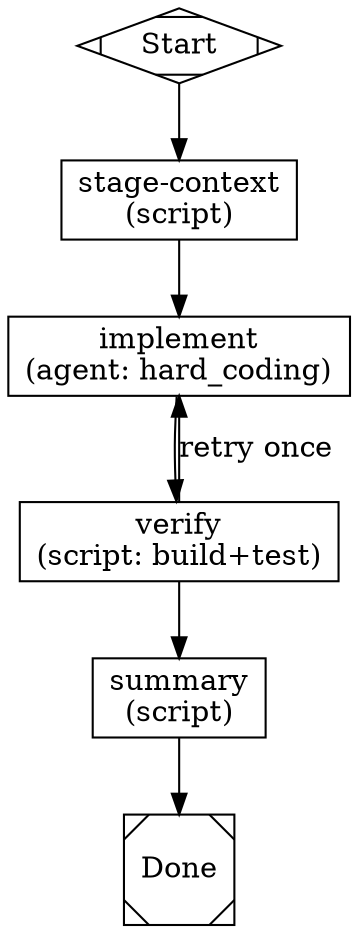

# Kilroy v2 — Final Plan

**Date:** 2026-05-01
**Branch:** `feat/v2-reframe`
**Status:** Synthesized from two parallel design drafts, six dogfooded research investigations, and direct ergonomic observation.

This document supersedes both drafts:

- `docs/plans/2026-05-01-kilroy-v2-workflow-platform-shift.md` (Plan A) — kept for product-framing language reference; otherwise superseded.
- `docs/plans/2026-05-01-v2-workflow-platform-reframe.md` (Plan B) — architectural skeleton lifted into this doc; otherwise superseded.

Source dogfood log: `docs/lab-notes/2026-05-01-v2-reframe-dogfood.md`.

---

## 0. How this plan was assembled

This plan is grounded in three sources:

1. **Two prior design drafts** (Plans A and B) aligned on direction but diverged on framing (product vs architecture) and detail level (10 broad spikes vs 6 self-contained research prompts).
2. **Six parallel quick-launch investigations** — research-style prompts run via `kilroy attractor run --tmux` from empty git repos under `/tmp/kilroy-v2-investigations/`. Each produced a `result.md` answering one focused question. All six succeeded; durations 127s–1102s; outputs total ~149 KB of structured analysis.
3. **Dogfooding observations** — captured while running the investigations themselves. Two real bugs surfaced (zombie validation-failure runs; symlink-induced stale-build false positives) and one shipped-graph regression (the quick-launch graph itself was broken against the current validator). These are not hypothetical risks — they are exactly the friction the v2 reframe is supposed to fix, observed live.

The investigations were chosen from Plan B because its prompts were already research-shaped, fitting quick-launch's "single-agent, fire-and-forget" model. Plan A's investigations were closer to internal code spikes that need access to the kilroy repo and are deferred to implementation work.

---

## 1. The shift, in one paragraph

Kilroy stops exposing engine, provider, model, backend, and auth machinery as primary user surface. Workflows become packaged units (`graph.dot` + `workflow.toml` + scripts/prompts) that ask for **abstract execution classes** (`hard_coding`, `quick_easy`, `deep_investigation`, …) rather than naming concrete models or providers. The CLI re-centers around `kilroy run <workflow>` returning an async run handle in machine-readable JSON by default; agents juggle many runs at once via `runs wait` / `runs show`. Routing knowledge lives in **baked-in policy data** shipped with the binary — no remote fetch, no per-machine drift, no mutable runtime override. Auth is **discovery and routing, not storage**. Failed launches persist as first-class run records. The `attractor` namespace dissolves; every subcommand moves to the top level.

Center of gravity shifts from "engine I drive" to "workflow I name."

---

## 2. Posture commitments (non-negotiable)

These shape every downstream decision. If a future change conflicts with one of these, it is wrong by default.

1. **Audit, not approval.** Kilroy records what happened. It does not gate runs on cost, taste, or operator judgment. If a route was selected, a fallback fired, auth was missing, a launch failed — that is captured cleanly. External tools and humans decide what to do with it.
2. **Agent-primary by default; humans pleasant-secondary.** The design target is an agent juggling a dozen Kilroy calls at once. Async-with-handle, JSON-by-default, polling-not-streaming, typed errors. `--pretty` is the human affordance, not the default.
3. **Local-first and release-stable.** The class catalog and policy data are baked into the binary. Workflow packages live on disk under `workflows/<name>/` and are discovered through a search path (KILROY_WORKFLOW_PATHS, project, user) — **not** embedded; on-disk source-of-truth is editable, dogfoodable, and avoids the embed-cache vs. runtime-edit drift problem. Behavior for a given Kilroy build is reproducible per-machine once the workflows directory is in place; routing changes are repo PRs.
4. **Additive surface, deprecate later.** The v2 CLI (`kilroy run`, `kilroy workflows`, `kilroy auth`, `kilroy policy`) lands alongside the existing `kilroy attractor *` namespace; both work during the v2 transition. Hard cut comes after consumer scripts have caught up. Where prior shapes were exposed (provider names, model IDs, backend toggles), they recede to expert escape hatches — not part of the default story.
5. **Failure is a first-class outcome.** Validation failures, missing auth, unreachable models, tool failures — all persisted in the run record from the launch path forward. No zombie runs.

---

## 3. Five-layer architecture

The codebase is organized into five conceptual layers. Each is independently shippable and has clean seams. Most of them already exist in some form; this is re-centering, not reinvention.

| # | Layer | Responsibility | State today |
|---|---|---|---|
| 1 | **Execution Core** | DOT graph traversal, run state, retries, events, run DB, resume, worktree isolation | Mostly stable; opinionated about mechanics, neutral about content |
| 2 | **Workflow Package** | `graph.dot` + `workflow.toml` + `scripts/`, `prompts/`, `assets/`. Hierarchical discovery (built-in → user → project). | Skill-shaped layout exists; manifest schema not formalized |
| 3 | **Policy Resolver** | Maps abstract class requests to concrete `(model, driver, transport, auth, codec, tool-control)` tuples. Reads baked-in data. | Does not exist as a layer; logic scattered across stylesheet/codergen-router |
| 4 | **Transport / Auth Layer** | The agent-conversation backend. Untangles the `AgentHandler` (API) vs `TmuxAgentHandler` (CLI/tmux) split into composable axes. | Two tangled handlers; needs the most refactoring |
| 5 | **Surfaces** | CLI commands and a data API server. UI (if any) consumes the data API; UI does not live in this layer. | CLI exists with `attractor` prefix; data API exists at `localhost:9700` |

The UI is **explicitly not a layer**. It is a separate consumer of the data API, optional, and not part of v2's value statement.

---

## 4. CLI shape

The top-level surface is small and stable. The `attractor` namespace dissolves entirely.

| Command | Purpose |
|---|---|
| `kilroy run <workflow> [args]` | Canonical workflow launch. Returns a JSON run handle. Async by default; `--wait` to block. |
| `kilroy runs list / show / wait / prune` | Run inspection. JSON by default; `--pretty` for humans. |
| `kilroy auth list / use / suggest-fix` | Discovery and routing of credentials (see §8). |
| `kilroy workflows list / describe / validate` | Workflow package discovery, inspection, validation. |
| `kilroy policy list / show / explain` | Read-only view of class catalog and how a class resolves on this machine. |
| `kilroy serve` | Data API server (existing). |

> **Bare-form retirement.** An earlier draft proposed a `kilroy <workflow>` bare form for a hard-coded blessed trio (`investigate`, `review`, `fix`). That feature is retired. Workflows are discovered uniformly via `kilroy run <name>`; there is no special bare command, no reserved-word list to maintain, and no first-class/second-class distinction between built-in and user-authored workflows.

### Output contract

- **JSON to stdout by default** for all commands that produce structured data. The shape is documented per command.
- **`--pretty`** emits human-friendly rendered output instead. Never partially mixed.
- **Typed errors:** `{"error": "<code>", "details": {...}, "remediation": "..."}` to stderr; non-zero exit code. Codes are stable; messages may improve over time.
- **Run handles** include at minimum: `run_id`, `status`, `workflow`, `policy_version`, `logs_root`, and follow-up commands (`runs show`/`runs wait` strings).

---

## 5. Workflow packages

A workflow package is a directory:

```
my-workflow/
├── workflow.toml            # manifest
├── graph.dot                # the workflow logic
├── prompts/                 # optional system-prompt templates
├── scripts/                 # optional script-node implementations
└── assets/                  # optional supporting files
```

### 5.1 Discovery

Hierarchical with **most-local-wins** precedence — when the same workflow name exists at multiple levels, the highest-precedence entry is used. Lookup order from highest precedence to lowest:

```
1. KILROY_WORKFLOW_PATHS  (colon-separated env var)                    ← dev escape hatch
2. Project                (<project-root>/.kilroy/workflows/)
3. User                   ($XDG_CONFIG_HOME/kilroy/workflows/,
                           default ~/.config/kilroy/workflows/)
```

There is **no embedded fallback** — workflow packages are filesystem-only. The shipped workflows in this repo live at `workflows/<name>/`; for end-user installs they're reached by symlink or installer copy into the user-config path, or by setting `KILROY_WORKFLOW_PATHS` during dev.

A project-defined `investigate` shadows a user-defined `investigate`. A warning is emitted at workflow-load time on any same-name shadowing so authors notice when a local definition supersedes another.

(Investigation 3 also recommends `.kilroy/` directory as the project marker — see §7 for the layered-config story.)

### 5.2 `workflow.toml` schema (TOML, not YAML)

TOML is the chosen format. Reasons (Inv1): comments are required for documentation, no Norway/whitespace footguns, multi-line strings work cleanly for verbose `description` fields, and TOML is the de-facto manifest standard for developer tooling (Cargo, pyproject, uv).

The schema:

```toml
[workflow]
name              = "investigate"      # required, kebab-case slug
version           = "1"                # required, integer interface-contract version (see §10.4)
description       = """                # required, verbose human-facing prose
                                       # (markdown ok; multi-line)
"""
agent_description = "Investigate a question and write findings to result.md."  # required, terse trigger text for agents
author            = "..."              # optional
tags              = ["research", ...]  # optional, free-form
graph             = "graph.dot"        # required, relative path
default_class     = "quick_easy"       # required, abstract class for any agent node without its own class

[inputs.<name>]                        # one table per input; map, not array
type              = "string|integer|float|boolean|path|enum"  # required
required          = true|false         # required
default           = ...                # optional, when required = false
description       = "..."              # required
enum_values       = [...]              # required when type = "enum"
positional        = 0                  # optional; if set, may be passed without a flag at index N
flag              = "--context"        # optional; if set, callers pass via this flag

[outputs.<name>]
type              = "path|string|integer|float|boolean"
description       = "..."
optional          = false              # default false; some outputs may not always be produced
path              = "result.md"        # for type=path: relative to workspace root

[side_effects]                         # all required; declarative planning signals, not enforcement
mutates_git       = false
writes_files      = false
network_egress    = false
idempotent        = true               # safe to re-run with same inputs

[nodes.<node_id>]                      # per-node overrides; node_id matches a label in graph.dot
class             = "deep_investigation"   # overrides default_class for this node
# OR
model             = "claude-opus-4-7"      # strict mode (no fallback) — class and model are mutually exclusive

[secrets]                              # optional; names of credentials the workflow needs
# entries are abstract names that the auth layer maps to concrete sources
needs             = ["github", "anthropic"]
```

### 5.3 Diverges from Claude skill manifests where Kilroy needs more

Inv1 surveyed 5–10 Claude skills and adjacent formats (custom commands, MCP tool defs, community plugin manifests). What Kilroy adds that they lack:

- **`graph` field** (skills aren't graphs).
- **`default_class` and `[nodes.*].class`** (skills assume the caller's model).
- **`[outputs.*]`** (MCP tools don't declare return schemas; commands are opaque).
- **`agent_description` separate from `description`** (Claude conflates these into one field; the merged text serves neither audience well).
- **`[side_effects]`** with kilroy-specific operational fields (`mutates_git`, `writes_files`, `network_egress`) instead of MCP's coarser `readOnlyHint`/`destructiveHint`.

### 5.4 Validation

`kilroy workflows validate <package>` runs the same checks the engine runs at launch:

- Manifest schema parse.
- DOT graph parse + semantic validation (current validator rules apply).
- `[nodes.*]` keys must reference real nodes in `graph.dot`.
- Class names must exist in the policy catalog (or be aliases).
- Strict-mode (`model =`) entries must be reachable per current machine state, OR pass `--ignore-machine-state` for offline check.

CI **must** validate every built-in workflow with this validator. (See §13 — direct dogfood lesson.)

---

## 6. Policy and class resolution

This is the most novel layer. Investigation 4 produced a complete schema, resolver, and metadata format. Adopting it.

### 6.1 Abstract classes are the workflow author's vocabulary

Workflows ask for a class — a name describing intent and capability — not a concrete model.

The v2 baseline class catalog (from Inv4):

| Class | Intent | Default route preference |
|---|---|---|
| `hard_coding` | Multi-file coding tasks needing deep reasoning | Opus 4.7 (CLI) → Opus 4.7 (API) → GPT-5 → Sonnet 4.6 (CLI) → Sonnet 4.6 (API) |
| `quick_easy` | Fast, cheap, single-step tasks | Haiku 4.5 (CLI) → Haiku 4.5 (API) → Gemini 2.5 Flash → Sonnet 4.6 (CLI) → Sonnet 4.6 (API) |
| `deep_investigation` | Long-context research and synthesis | Opus 4.7 (CLI) → Opus 4.7 (API) → Gemini 2.5 Pro → GPT-5 → Sonnet 4.6 (CLI) |
| `frontend_aesthetic` | UI/UX critique, frontend code with visual sensibility | GPT-5 → Sonnet 4.6 (CLI) → Sonnet 4.6 (API) → Gemini 2.5 Pro → Haiku 4.5 (CLI) |
| `architectural_critique` | System design review, ADR generation | Opus 4.7 (CLI) → Opus 4.7 (API) → GPT-5 → Gemini 2.5 Pro → Sonnet 4.6 (CLI) |

Subscription/CLI routes are preferred over API-key routes throughout, capping cost exposure when a workflow loops.

### 6.2 Policy data shape (baked in)

Policy lives at `internal/policy/data/policy.toml`, embedded via `//go:embed`. It is **read-only at runtime**. The format is TOML; full Go structs and example entries are specified in Inv4 result.md (see Resolved-questions in §15 if more detail is needed inline).

```toml
schema_version = "1"
policy_version = "2.0.0"

[classes.<name>]
description = "..."
[[classes.<name>.chain]]
  model_id     = "claude-opus-4-7"
  driver       = "claude_cli"
  transport    = "cli_subprocess"
  history_sink = "jsonl_local"     # to be renamed "turn codec" — see §9
  tags         = ["subscription", "tier:elite"]
  [classes.<name>.chain.auth]
    kind = "cli_session" | "env_var" | "none"
    env_var = "ANTHROPIC_API_KEY"  # when kind == env_var
    cli     = "claude"             # when kind == cli_session

[[aliases]]
from = "coding"; to = "hard_coding"

[[deprecated]]
class = "legacy_coding"; since = "v2.0.0"; sunset = "v2.2.0"; message = "..."
```

### 6.3 Resolution algorithm

At launch, the resolver:

1. Snapshots **machine state** once: env vars present (names only, never values), CLI binaries on PATH, CLI session probes (lightweight `whoami`-style checks, parallelized with a 500ms deadline).
2. For each agentic node:
   - If the workflow specifies `model = "..."` → strict mode: walk the class chains for matching `model_id`, prefer subscription over api_key. If unreachable, the run fails loudly with `ErrStrictModelUnreachable`.
   - If the workflow specifies `class = "..."` → flexible mode: walk that class's `chain` in order, picking the first candidate whose `auth` requirement passes the machine-state check.
   - If neither is set → use workflow's `default_class`.
3. Records the resolved tuple **in step metadata** as the step starts running. This is normal step metadata, not a separate "snapshot."
4. On exhausted chain: typed error `ErrNoViableCandidate` with the list of all skipped candidates and reasons.

### 6.4 Step metadata for resolution

Each agentic step persists a `resolution` object in its metadata:

```json
{
  "schema_version": "1",
  "node_id": "...",
  "workflow_id": "...",
  "resolution": {
    "requested": { "type": "class|strict", "value": "..." },
    "resolved":  { "model_id": "...", "driver": "...", "transport": "...", "auth_method": "...", "history_sink": "..." },
    "fallback_rank": 0,
    "skipped": [
      { "rank": 0, "model_id": "...", "driver": "...", "reason": "env_var_missing:ANTHROPIC_API_KEY" }
    ],
    "policy_version": "2.0.0",
    "resolved_at": "..."
  }
}
```

`reason` codes are structured `<code>:<detail>` so tooling can produce targeted remediation. (See §8 for how this connects to `kilroy auth suggest-fix`.)

### 6.5 Class evolution

- **Add** a class: harmless to old workflows.
- **Rename** a class: add an `[[aliases]]` entry; old name still resolves with a warning.
- **Deprecate** a class: add `[[deprecated]]` with `since` and `sunset` versions; warning logged on every use.
- **Remove** a class at sunset: workflows referencing it fail with `ErrClassSunset` unless an alias was added.

Version-pinning (`class = "hard_coding@v2.0.0"`) is **out of scope for v2**. Aliases + deprecation cycle handle the realistic cases.

### 6.6 `kilroy policy` (read-only)

```
kilroy policy list                         # all class names + summaries
kilroy policy show <class>                 # full chain with current machine reachability per candidate
kilroy policy explain <run-id>             # why this run picked this candidate; reads from step metadata
```

There is intentionally **no** `kilroy policy set / override`. Policy mutations are repo PRs. (Trade noted: contributors who want different policy must fork or PR upstream. Acceptable for v2; revisit if real demand for per-deploy override emerges.)

---

## 7. CWD-aware invocation and config layering

Investigation 3 surveyed git, gh, cargo, npm, kubectl, direnv, just. Adopting:

### 7.1 Project root marker

**Sole marker: `.kilroy/` directory.** Borrowed from `.git/`'s pattern. Houses `config.toml`, `workflows/`, and any other per-project state.

### 7.2 Upward search

```
Start: invocation CWD
Loop:
  1. If <dir>/.kilroy/ exists → project root found.
  2. If <dir> == $HOME → stop (no project; user-only mode).
  3. If <dir> == filesystem root → stop.
  4. Move to parent and repeat.
```

Termination at `$HOME` matches npm/cargo's "stay in user-namespace" implicit boundary. Termination at `/` is a backstop for containers where `$HOME` may not bound the workspace mount. **Do not** terminate at `.git` — monorepos may legitimately nest `.kilroy/` projects inside a single git repo. Only the **nearest** `.kilroy/` is used; no ancestor merging.

### 7.3 Config layering

Three layers, with merge-vs-override semantics by field type:

```
Built-in defaults              (compiled in)
    ↓ overridden by
User config                    ($XDG_CONFIG_HOME/kilroy/config.toml)
    ↓ overridden by
Project config                 (<project-root>/.kilroy/config.toml)
```

- **Scalar fields** (strings, bools, ints) — project overrides user.
- **Map fields** (`[workflows]`, `[env]`) — merged with project-key-wins on collision; user-only keys preserved.
- **Path fields** in project config resolve relative to **project root** (the directory containing `.kilroy/`), not to invocation CWD. Same as cargo and kubectl.

### 7.4 Precedence (highest → lowest)

```
1. CLI flags
2. KILROY_* env vars
3. Project config       (<repo>/.kilroy/config.toml)
4. User config          (~/.config/kilroy/config.toml)
5. Built-in defaults
```

`KILROY_PROJECT_ROOT=...` is an explicit override that bypasses upward search. **It must error loudly** if the named directory has no `.kilroy/`. Silent fallback after an explicit override is exactly the kubeconfig-pointed-at-deleted-file failure mode that confuses operators.

### 7.5 Pitfalls explicitly handled

From Inv3 §4:
- **Nested git repos / submodules** — `.git` is not a search-termination boundary; we walk past it. `.git` may be a file (in submodules), which makes "is `.git` a directory?" fragile anyway.
- **Symlinked workspaces** — discovery walks `$PWD` (logical), reads files via realpath. Direnv documents this gotcha.
- **Mounted volumes / containers** — recommend `KILROY_PROJECT_ROOT` in CI configs.
- **User-config polluting projects** — projects can declare `inherit_user_runtime = false` to opt out.

---

## 8. Auth as discovery and routing

From Investigation 2 — the auth layer's surface is `discover, report, route`. Never `store, rotate, own`.

### 8.1 What `kilroy auth list` scans

Files and env vars across major LLM CLIs (full table in Inv2 §1):

- Claude CLI — macOS Keychain (`Claude Safe Storage` / `Claude Key`) + `~/.claude/settings.json`
- Codex CLI — `~/.codex/auth.json` (OAuth + JWT, with `last_refresh`, `auth_mode`)
- gh — Keychain `gh:github.com:<user>` + `~/.config/gh/hosts.yml`
- Gemini CLI — `~/.gemini/oauth_creds.json` (OAuth) or `~/.gemini_key` (API key)
- Aider — env vars or `~/.aider.conf.yml` (key aggregator only)
- OpenCode — `~/.local/share/opencode/opencode.db` SQLite
- Cursor — Keychain `cursor-{access,refresh}-token` + `~/.cursor/cli-config.json`
- Direct API keys via env vars: `ANTHROPIC_API_KEY`, `OPENAI_API_KEY`, `GOOGLE_API_KEY` / `GEMINI_API_KEY`, `OPENROUTER_API_KEY`, `GH_TOKEN` / `GITHUB_TOKEN`

### 8.2 Detection algorithm (4 phases)

1. **Stat env vars** — sub-millisecond, always first.
2. **Stat config files** — existence checks, no opens.
3. **Read and validate** — only files that exist; per-tool logic for OAuth expiry, JWT decode, multi-profile parsing.
4. **Resolve conflicts and dedupe** — when same provider has multiple sources, emit all but mark `shadows`/`shadowed_by` per the runtime precedence (env var > CLI OAuth > API key file).

### 8.3 JSON output shape

```typescript
{ kind: "env_var" | "cli_oauth" | "cli_api_key" | "api_key_file" | "keychain",
  provider: "anthropic" | "openai" | "google" | "github" | "openrouter",
  tool: "claude" | "codex" | "gh" | ... | null,
  state: "ok" | "expired" | "missing" | "ambiguous",
  identity?: { email, user, org, account_id },
  expiry?: { access_token_expires_at, refresh_token_present, refreshable },
  source: { env_var?, file?, keychain_service?, keychain_account? },
  profiles?: [{ name, active, identity, state }],
  shadows?: [...id],          // entries this one shadows at runtime
  shadowed_by?: [...id],
  notes: string[],
  remediation?: string }       // present when state != "ok"
```

### 8.4 Edge cases that must be handled

- Stale tokens that look valid (JWT `exp` future, but `last_refresh` >30 days) → `state: "ambiguous"` with a note.
- Partial logins (config exists, token field null) → `state: "ambiguous"`.
- Login-in-progress (file size 0, mtime < 60s) → `state: "ambiguous"`, note "may be mid-write."
- Multi-profile (gh, Codex) → enumerate in `profiles[]`, top-level identity reflects active profile.
- Provider via two paths (env var + CLI OAuth) → both emitted, `shadows`/`shadowed_by` disambiguates.

### 8.5 Remediation

Every `state != "ok"` entry includes a `remediation` string. Examples (from Inv2 §5):

```
codex expired       → "Run: codex (triggers token refresh)"
gh missing          → "Run: gh auth login"
gemini ambiguous    → "~/.gemini/oauth_creds.json malformed. Delete and re-run gemini."
```

These remediation strings are also surfaced when a class resolution skips a candidate — the resolver's `reason` code (`env_var_missing:ANTHROPIC_API_KEY`, `cli_no_session:claude`) maps directly to an auth remediation.

### 8.6 What Kilroy does NOT do

- Store secrets (no keychain writes).
- Rotate tokens (no `gh auth refresh` automation).
- Own credential lifecycle (no "kilroy login" wrapping `claude` login flows).

---

## 9. Agent-conversation tuple

Investigation 5 validated the tuple proposal and made two changes — **one rename and one new axis**.

### 9.1 Revised six-axis tuple

| # | Axis | Definition | Example values |
|---|---|---|---|
| 1 | **model** | Concrete model identifier including revision | `claude-sonnet-4-6`, `gpt-5`, `gemini-2.5-pro`, `llama3.2` |
| 2 | **driver** | Entity orchestrating turns and submitting requests | `kilroy-direct`, `claude-cli`, `codex-cli`, `aider` |
| 3 | **transport** | I/O channel between driver and model (or kilroy and driver) | `https`, `http-local`, `stdio-pipe`, `tmux-pty` |
| 4 | **auth** | Credential resolver for the transport | `env-var`, `cli-login`, `keychain`, `no-op` |
| 5 | **turn codec** *(renamed from "history sink")* | Encoder for outgoing messages + decoder for incoming events | `anthropic-sse`, `openai-sse`, `claude-cli-jsonl`, `aider-markdown` |
| 6 | **tool control** *(new)* | Who owns the tool-call dispatch loop | `kilroy` (API path, Ollama), `driver` (CLI/tmux path) |

**Why the rename.** "History sink" is write-only naming for what is actually a bidirectional codec — it encodes outgoing messages and decodes incoming event streams. The concept stays; the name was wrong.

**Why `tool control` is new.** It is the deepest semantic difference between the API path and the CLI/tmux path, and it was invisible in the original tuple. In the API path, kilroy owns the tool-call loop and must inject `tool_result` back into the conversation. In the CLI/tmux path, the `claude`/`codex`/`opencode` binary owns the loop internally; tool-call events arriving at kilroy are informational only. Without an explicit axis, kilroy cannot know whether to run a tool loop or just observe one.

### 9.2 Decisions on collapsing or adding

- **Don't collapse `driver` and `transport`.** Apparent redundancy is real (claude-CLI ↔ tmux-pty, kilroy-direct ↔ HTTPS), but a third pairing is plausible (`claude-CLI` over plain stdio for CI use), and the value of preserving composability outweighs the symmetry tax.
- **Don't make `auth` a property of `transport`.** Credentials refresh on a different cadence than connections; auth as a standalone resolver consulted per-call is the right model.
- **Don't add `cancellation` as a seventh axis.** Encode it as a required interface method whose semantics are documented per backend (HTTP abort vs SIGTERM vs `tmux send-keys C-c`).
- **Don't add `streaming granularity` as a seventh axis.** Fold it into `turn codec`.
- **Don't add `cost tracking` as a seventh axis.** Optional output of the codec; nullable field on the turn-end event.
- **Don't add `extended thinking` as a seventh axis.** Capability flag on the (driver, model) pair, exposed via `backend.Capabilities()`.

### 9.3 `AgentBackend` Go interface

(Sketch from Inv5 §6, lightly tightened.)

```go
package backend

type ToolControlMode int
const (
    ToolControlKilroy ToolControlMode = iota   // kilroy injects tool_result
    ToolControlDriver                          // driver owns the loop
)

type AgentBackend interface {
    StartTurn(ctx context.Context, msg UserMessage, opts TurnOptions) (TurnStream, error)
    ToolControl() ToolControlMode
    Capabilities() BackendCapabilities
    Close() error
}

type TurnStream interface {
    Recv() (TurnEvent, error)                                // io.EOF on normal turn-end
    SendToolResult(ctx context.Context, r ToolResult) error  // ErrToolControlDriver if driver owns
}

type TurnOptions struct {
    Model           string                  // required
    Tools           []ToolSchema            // ignored when ToolControl == driver
    ThinkingBudget  int                     // 0 means disabled
    Extra           map[string]any          // backend-specific escape hatch
}

type BackendCapabilities struct {
    Thinking, TokenStreaming, CostTracking, ToolInjection bool
}
```

Cancellation is via `ctx`; no separate `Cancel()` method. `SendToolResult` lives on `TurnStream`, not on the top-level interface, because it is stateful to a specific in-flight turn.

### 9.4 Migration order (high effort surface)

This is the largest single block of refactoring work in v2. Recommended sequence (from Inv5 §7):

1. Define `TurnEvent` types and `TurnStream` interface — unblocks codec extraction.
2. Extract turn codecs (Anthropic SSE, OpenAI SSE, claude-CLI JSONL, codex-CLI JSONL) into standalone parsers with full test coverage.
3. Define `AgentBackend`, `ToolControlMode`; wrap existing `AgentHandler` and `TmuxAgentHandler` as adapters.
4. Extract transport layer (HTTP client, tmux pty) into standalone components.
5. Define `AuthResolver`; inject it; touch every place a key is read.
6. Add the `ToolControlKilroy` loop in the new orchestration layer; verify against both backends.
7. **Add an Ollama backend as a forcing function** to validate the interface is complete. If it slots in cleanly with no new types — only new values — the tuple is doing its job.

This order minimizes regression risk by extracting the high-coupling pieces (codecs, transport) first under test, before the orchestration layer changes.

---

## 10. Shipped workflows

Investigation 6 evaluated 11 candidates against four filters: generality, stable interface, distinctness, resistance to taxonomy creep. The bar held — `investigate`, `review`, and `fix` ship in the source tree under `workflows/<name>/`. They are reached via `kilroy run <name>` like any other workflow; **the earlier "blessed three with bare-form CLI" framing is retired** (see §4 note). The trio is "shipped" in the sense that we author them; not "blessed" in the sense of getting a special CLI surface.

### 10.1 The shipped trio: `investigate`, `review`, `fix`

| Workflow | Class | Inputs | Outputs | Side effects |
|---|---|---|---|---|
| `investigate` | `deep_investigation` | `question` (string), `--context paths`, `--url urls` | `result.md` | `idempotent` |
| `review` | `hard_coding` | `target` (PR URL / branch / .patch), `--checklist`, `--post` | `result.md`, `review.json` | `idempotent` (or `network_egress` with `--post`) |
| `fix` | `hard_coding` | `issue` (string / URL), `--context paths`, `--apply`, `--branch` | `fix.patch`, `result.md` | `writes_files` (or `mutates_git` with `--apply`) |

The trio carves up the three orthogonal coding-workspace operations: *understanding*, *evaluation*, *transformation*. Each input contract has been stable for decades of software development; each output is a typed file or diff; the three are each daily, not weekly, for a coding agent doing a feature branch end-to-end.

### 10.2 What got cut and why

- **`summarize`** — too close to `investigate`. Elevating both invites cargo-culting every imperative verb.
- **`debug`** — subsumes into `fix`. Diagnosis without mutation is a corner case; for that, `kilroy run debug` (non-bare) is fine.
- **`refactor`** — `kilroy fix "extract auth into its own module"` is exactly this.
- **`test`** — fatally ambiguous (generate vs run); two different graphs sharing a verb is a smell.
- **`document`**, **`fix-flake`**, **`audit-deps`**, **`scope-pr`** — too narrow or not weekly.

### 10.3 Shipped workflow packaging

Shipped workflows live at `workflows/<name>/` in the kilroy repo. They're discovered through the filesystem search path (KILROY_WORKFLOW_PATHS, project, user) — **not** embedded via `go:embed`. The earlier embed-and-`internal/workflows/` plan was dropped; on-disk source-of-truth is editable, dogfoodable, and avoids the embed-cache vs runtime-edit drift problem. Validated in CI by the same validator the runtime uses (see §13). They use the public workflow.toml schema — no special privileges.

For end users, the discovery story makes shipped workflows reachable from any cwd via the user-config path (`~/.config/kilroy/workflows/`) populated either by symlink during dev (`ln -s <repo>/workflows ~/.config/kilroy/workflows`) or by an installer copy at packaging time.

### 10.4 Versioning

- The `version` field in `workflow.toml` is the **interface contract version**. Integer. Increments only on breaking changes (required input added, output renamed, side-effect class widened, agent class upgraded with cost implications).
- `kilroy run investigate@1` syntax allows pinning to a major version. (Implementation deferred — current state is unpinned.)
- Breaking changes follow a two-phase deprecation: announce (warning), remove (no sooner than the next minor CLI release).
- Non-breaking changes (prompt rewording, internal script swaps, model upgrades within the same class) are transparent and don't bump the version.

---

## 11. Run records, recursion, concurrency

These three are mostly already-working and need polish, not rebuild.

### 11.1 Run records

- Existing CXDB + rundb + per-run `logs_root` stays. It's working well.
- Step metadata captures the resolved tuple (§6.4) — normal step metadata, written as the step runs.
- Validation failures persist a `final.json` with `status: fail` and `failure_reason: validation_failed` **before** the worker exits (see §13).
- Retrieval: CLI commands + the data API server. UI is a separate consumer.

### 11.2 Recursion (Kilroy calling Kilroy)

- Allowed and supported. Common pattern for agent-orchestrated workflows.
- Inner kilroy detects parent via `KILROY_PARENT_RUN_ID` env var.
- Inner run links to outer in the DB on startup.
- `kilroy runs show <outer>` displays nested children.
- Cancellation does **not** propagate. Outer cancellation leaves inner runs alive; outer status reflects unresolved children.
- Recursion-depth cap: deferred. Pick a number after observing real misuse.

### 11.3 Concurrency hardening

Multiple sibling Kilroy runs from a single orchestrating agent must be airtight isolated. **Load-bearing for the agent-primary commitment.**

- Separate worktrees (already isolated under `<logs_root>/worktree/`).
- Separate logs roots (already done).
- Separate DB rows.
- No shared mutable state, no port collisions, no lock contention beyond what the DB handles cleanly.

A stress test ("launch 12+ sibling runs of distinct workflows from one parent run; verify all complete; verify no cross-contamination") is a v2 acceptance gate. The 6-parallel investigations behind this plan are a starting data point — all six succeeded with no observed cross-talk.

---

## 12. What's explicitly out of scope for v2

These are intentional non-goals. They keep the core small.

- **A built-in UI as a primary product surface.** Kilroy emits data; UI rendering is a separate project consuming the data API. (A bundled UI may exist as convenience, but is not part of v2's value statement.)
- **Mutable runtime routing** — no `kilroy policy set`, no remote fetch, no per-machine override. Routing changes are repo PRs.
- **Secret storage / rotation / lifecycle.** Discovery and routing only.
- **SSE / streaming live status to consumers.** Polling via `runs wait` / `runs show` is sufficient.
- **Recursion depth caps.** Defer; pick a number after observing real misuse.
- **Cost gating / budget enforcement.** Audit, not approval — capture costs in step metadata, let external tools act.
- **User/project policy override.** Not in v2; revisit if a contributor or org asks for it.
- **Class version-pinning syntax** (`hard_coding@v2.0.0`) — aliases + deprecation handle the realistic cases.

---

## 13. Dogfood-driven additions

These were not in either prior plan. They emerged from running the six investigations through quick-launch and observing real friction. They are **prerequisites** to v2's promises being credible.

### 13.1 Failed-launch persistence

**Observed:** A shipped quick-launch graph violated the recently-added validator (`agent → done` lacks `condition=`). On `attractor run --detach`, the launcher returned exit 0 with a logs_root, run.pid was written, but the worker process exited immediately. `runs show` reported `status: running` indefinitely. `runs wait --timeout` hung the full timeout. No `live.json`, no `progress.ndjson`, no `final.json` was ever created — only a `run.out` containing the validation error.

**For v2:** validation failure must persist a `final.json` with `status: fail` and `failure_reason: validation_failed` **before** the worker exits. The run-record machinery is already 90% there; the validation path needs to use it. This is the concrete shape of the "failed launch is a first-class persisted run outcome" commitment in §2.

### 13.2 CI test for built-in workflow graphs

**Observed:** The shipped `~/.local/share/kilroy/workflows/quick-launch/graph.dot`, `graph.codex.dot`, and `graph.gemini.dot` were all broken against the current validator. The validator was tightened in commit `95637c9`; the workflow graphs were never re-validated. The failure mode (zombie running record) hides the regression from anyone watching.

**For v2:** every built-in workflow must be validated in CI by the same validator the runtime uses. This is a `go test ./...` regression test, not an add-on. If the validator rejects a baked-in workflow, the build fails. The same gate applies to anything embedded via `go:embed`.

### 13.3 Stale-build detection scoping

**Observed:** `~/.local/bin/kilroy` is a symlink into the dev repo (`/Users/matt/sw/personal/kilroy/kilroy`). When invoked from `/tmp/...` (any non-kilroy CWD), kilroy compared the binary's embedded build SHA against the dev repo's HEAD and refused to launch.

**For v2:** stale-build detection should fire only when invocation CWD is the binary-source repo (clearly dev mode). Released binaries should not perform stale-build checks at all — the embedded SHA is a build-time fingerprint, not a runtime invariant. Implementation: distinguish a "released" build (no in-repo SHA comparison, period) from a "dev" build (compare against repo HEAD only when CWD is inside the binary-source repo's worktree).

### 13.4 `runs wait` exit-code audit

**Observed:** `kilroy attractor runs wait --latest --label task=v2-pilot --timeout 8m` exited with 0 after the timeout fired, despite the skill doc saying it should exit 2 on timeout. Could be a `--latest --label` interaction.

**For v2:** audit and fix; document the contract per command in the JSON output schema.

### 13.5 Zombie-run garbage collection

**Observed:** The first failed-launch run record (`01KQJ5PDMTPPERR8FT87QSQ1SS`, label `v2-pilot`) is still showing `status: running` in `runs list` even though its pid is dead. With §13.1 fixed, new zombies stop being created — but existing zombies remain.

**For v2:** add a `kilroy runs prune --zombies` (or extend the existing `runs prune`) that detects records with `status: running` whose pid is dead and marks them `status: fail` with `failure_reason: orphan_detected`. Possibly run automatically at every `runs list` invocation, with an opt-out flag.

### 13.6 Pre-launch validation layer (replaces "old garbage preflight" — LANDED)

**Observed:** The legacy `runProviderCLIPreflight` machinery was tangled with the old graph-attribute model, did expensive LLM probes by default, and (until commit `dfd456a`) was even reading raw `llm_provider`/`llm_model` instead of policy-resolved routes. The probes also burn money on every `--validate` invocation. That's a poor fit for "validation during run" the v2 thesis wants — fast, cheap, predictable.

**For v2 (LANDED):** `engine.ValidatePreLaunch` is the new front door. For every agentic node it resolves the `class=` attribute through the policy chain, confirms the resolved candidate's auth is present in the machine-state snapshot, and (for CLI drivers) confirms the binary is on PATH. No LLM calls. Writes `<logs_root>/prelaunch_validation.json` with the resolved tuple per node. Failures abort before the legacy preflight runs, so `--validate` against a typo'd class fails in milliseconds with no provider auto-detection cost. The legacy preflight still runs after prelaunch on real launches (gated by `--skip-preflight`), but is now a deprecated layer to be removed once it covers nothing prelaunch doesn't already.

---

## 14. Work breakdown — ordered for shippability

Each block below is independently shippable. Roughly the order I'd tackle them, though hard dependencies are explicit.

### Block 0: Pre-v2 cleanup (do first; clears dogfooding noise) — **LANDED**

These were real bugs visible today; they didn't need v2's reframe to land.

- [x] §13.1: Validation-failure persists a `final.json` with `failure_reason`. (commit `a5d0a66`)
- [x] §13.2: CI test that validates every embedded built-in workflow's `graph.dot`. (commit `6bc55c4`)
- [x] §13.3: Scope stale-build detection to dev-mode invocations only. (commits `ee4cfdf` + `ccb053c`; option (a) and option (b) both)
- [x] §13.4: Audit `runs wait` exit codes; document them. (commit `270a1ed` for tests; user-facing usage doc added in `1a86563`'s sibling commit on `runsUsage()`)
- [x] §13.5: `runs prune --zombies` for the existing zombie records. (commit `6e4e690`; mutation-order correctness fix in `1a86563`)
- [ ] Patch upstream `kilroy-ui-split/workflows/quick-launch/graph*.dot` with `condition="outcome=success"` on `agent → done` (already fixed in this user's installed copy). Open as a PR upstream.

### Block 0.5: Test-fixture cleanup for `terminal_condition_edge` regression

Surfaced during Block 0 dogfooding. Commit `95637c9` tightened the validator; ~180 test files in `internal/attractor/engine/` and `cmd/kilroy/` use inline DOT graphs with unconditioned `a → exit` edges that the new validator rejects. Fix is mechanical: add `condition="outcome=success"` (or the failure-path equivalent for tests that exercise failures).

- [x] Engine test fixtures `[a-c]*_test.go` (Run A campaign). (commit `94b7d2c`)
- [x] Engine test fixtures `[d-m]*_test.go` (Run B campaign + parallel_test.go reconciliation). (commit `503674c`)
- [x] Engine test fixtures `[n-z]*_test.go` + cmd/kilroy testdata + preflight tests (Run C salvage + manual sweeps for status_json_test, wait_human_test, reliability_helpers all-conditional fixtures, provider_preflight chain-graph splits). (commit `d843ff7`)
- [x] `cmd/kilroy/main_detach_test.go` `writeDetachGraph` fixture (caught by external review after initial Block 0.5 close-out). Subsequent commit.

After this block: 182 → 2 known pre-existing failures (`TestRunWithConfig_AllowsKimiAndZai_WhenCatalogUsesOpenRouterPrefixes`, `TestRunWithConfig_PreflightPromptProbe_AllProvidersWhenGraphUsesAll`) — both kimi/zai-catalog issues already in project memory.

### Block 1: CLI surface collapse — **`kilroy run` LANDED; cobra + bare-form retired; namespace dissolution still pending**

> **Reframe (this branch):** the §10 "blessed three with bare form" feature is retired. Workflows are discovered, not bare commands. `kilroy fix` will not exist; `kilroy run fix` does. Reserved-word complexity goes away with it. Cobra is also out — current arg parsing handles this fine.

- [x] **`kilroy run <workflow-name>` canonical form.** Resolves the name via filesystem discovery (see Block 2 below) and dispatches to the existing engine entry point. `kilroy attractor run` keeps working in parallel — additive, not a hard cut. Tests in `cmd/kilroy/run_test.go`. Live dogfood: run `01KQMAPDKGSSGHARZSXM7MXPVB` (`kilroy run implement` against the in-tree workflows via `KILROY_WORKFLOW_PATHS`).
- [ ] Drop `attractor` namespace; move remaining subcommands to top level. (Out of scope for now — we're aliasing rather than cutting until consumer scripts catch up.)
- [ ] Replace hand-rolled arg parsing with cobra. **Retired.** Cosmetic; current parsing is adequate.
- [ ] Reserved-word-list bare form for the blessed three. **Retired.** Workflows are discovered uniformly via `kilroy run <name>`; no special bare commands.
- [ ] Default execution: async-with-handle, `--wait` to block, JSON-by-default with `--pretty` for humans. (`--detach` already gives the async handle; the default is still synchronous; `--pretty` flag is an open polish item.)
- [ ] Typed-error output schema; document codes.

### Block 2: Workflow registry — **discovery + v2 schema LANDED; secrets resolution still pending**

- [x] **`workflow.toml` v2 schema** (§5.2): `[workflow]`/`[inputs.<name>]`/`[outputs.<name>]`/`[side_effects]`/`[nodes.<id>]`/`[secrets]` tables. Parser in `internal/attractor/workflows/manifest_v2.go` auto-detects v2 vs legacy `[[inputs]]` and emits a unified `Manifest`. `LoadPackage` populates both `Manifest` (v2) and the legacy `PackageManifest` shim during the transition — no hard cut.
- [x] **Filesystem discovery** with KILROY_WORKFLOW_PATHS > project (`<root>/.kilroy/workflows/`) > user (`$XDG_CONFIG_HOME/kilroy/workflows/`) precedence in `internal/attractor/workflows/discovery.go`. No embedding — workflow source-of-truth stays on disk where authors edit it.
- [x] **Re-author existing workflows** (`fix`, `implement`, `investigate`) in v2 shape. All three now declare `[workflow]`, typed `[inputs.<name>]`, typed `[outputs.<name>]`, `[side_effects]`, and `[nodes.agent].class`. Live dogfood: run `01KQMB4SHM9X807HPRQAHY1Q6C` (`kilroy run implement` via v2 manifest, 22s, success, `policy_class_resolved` fired).
- [x] **`kilroy workflows list / describe`** in `cmd/kilroy/workflows.go`. List shows name/class/description across all discovery paths (sorted, shadowing applied). Describe surfaces full v2 schema (inputs with types/required/defaults, outputs, side effects, node overrides, secrets). JSON-by-default tagging via struct tags. Tests in `cmd/kilroy/workflows_test.go`.
- [ ] **`kilroy workflows validate`** as a discovery-aware sibling of `kilroy attractor validate --graph`. (DOT validation is already gated by `shipped_graphs_test.go`; this would be the user-facing CLI.)
- [ ] **`[secrets]` block semantics** — currently the names parse and surface in `describe` output but aren't resolved through the auth layer at run time.

### Block 3: CWD-aware defaults and config layering

- [ ] Implement `.kilroy/` directory marker with upward search (§7.2).
- [ ] User config at `$XDG_CONFIG_HOME/kilroy/config.toml`, project config at `<root>/.kilroy/config.toml`.
- [ ] Layering with merge-vs-override semantics by field type (§7.3).
- [ ] Precedence order (§7.4) including loud failure on bogus `KILROY_PROJECT_ROOT`.
- [ ] Pitfall coverage (§7.5).

### Block 4: Policy data and resolver — **Steps 1–6 LANDED (Block 4 complete); deprecation exercise + semver upgrade still optional**

- [x] Define policy.toml format (§6.2). (commit `9b1a4a8`)
- [x] Author baseline policy with the 5 v2 classes (§6.1). hard_coding seeded in Step 1; quick_easy, deep_investigation, frontend_aesthetic, architectural_critique authored by Block 4 Run classes worker.
- [x] Embed via `//go:embed` at build time. (commit `9b1a4a8`)
- [x] Implement the resolver: machine-state collection (consumes `internal/auth.ListAll`), class chain walk, strict-mode lookup. 10 sub-tests covering match, fallback, all-unreachable, unknown-class, alias, strict match/missing/unreachable, both-modes, none-auth.
- [x] `kilroy policy list / show <class>` with `--json` and alias resolution. Unknown-class error includes sorted available class list, exits 1.
- [x] Aliases + deprecation table (§6.5). Aliases (`coding → hard_coding`, `fast → quick_easy`, `research → deep_investigation`) work; deprecation table is parsed and code path is wired but no live deprecation entries yet.
- [x] **Step 4a (API path)** — `AgentRouter.Run` reads `node.Attr("class", "")`, calls `policy.Resolve` against current machine state, and overrides the stylesheet's `llm_provider`/`llm_model`/backend with the resolved tuple. Driver-to-(provider, backend) mapping helper covers all 5 v2 drivers. New `policy_class_resolved` progress event records the class, model, driver, fallback rank. (commit `e6cb6b5`)
- [x] **Step 4b (CLI/tmux path)** — landed via option (ii): extracted `engine.ResolveAgentClass` helper in `internal/attractor/engine/policy_class.go` shared by both `AgentRouter` (API path) and `TmuxAgentHandler` (tmux path). Helper owns the `policy_class_resolved` event emission so both paths get it for free. `TmuxAgentHandler` calls the helper before reading `agent_tool`/`llm_model`; on a class hit, driver→tool mapping (`claude_cli`→`claude`, `codex_cli`→`codex`, `gemini_cli`→`gemini`) overrides the legacy `agent_tool` attribute and the resolved model overrides `llm_model`. SDK-driver hits under `--tmux` fail loudly with a typed error (no silent fallback). Tmux side also now emits `provider_selected` for surface symmetry with the API path. Regression test in `internal/attractor/agents/tmux_handler_class_test.go` covers class override, non-CLI-driver error, and the driver→tool table. Live `--tmux` dogfood: run `01KQK88MH7SH8M9E3CN5QCYZMV` (workflows/implement, 26s, status=success) — `progress.ndjson` contains `policy_class_resolved` (class=hard_coding, model=claude-opus-4-7, driver=claude_cli, fallback_rank=0) and `tmux_command.txt` shows `claude --model claude-opus-4-7 ...` (the resolved model, not the stylesheet's claude-sonnet-4.6).
- [x] **Step 5** — `engine.ResolveAgentClass` now persists the full `ResolveResult` (request type/value, resolved tuple, fallback rank, skipped candidates with structured reasons, policy version, resolved_at) to `<logs_root>/<node_id>/resolution.json` per plan §6.4 schema. Best-effort write: nil exec or empty logs_root silently skip without affecting the in-memory result. Unit tests in `policy_class_persist_test.go` cover both the full-shape happy path (with skipped candidates) and the no-logs-root safety case. Live dogfood: run `01KQK9FS72V7F2SP40CHCP4F68` (workflows/implement, --tmux, 21s, success) wrote `agent/resolution.json` with `requested.type=class`, `resolved.model_id=claude-opus-4-7`, `resolved.driver=claude_cli`, `policy_version=2.0.0`, `fallback_rank=0`. Step 6 (`kilroy policy explain <run-id>`) consumes this artifact.
- [x] **Step 6** — `kilroy policy explain <run-id>` reads per-step `resolution.json` artifacts and renders them in either text or `--json` form. Uses `rundb.GetRun` so unique-prefix IDs work (`kilroy policy explain 01KQK9FS` ← shorter form). CLI tests in `cmd/kilroy/policy_explain_test.go` cover the JSON shape, the text rendering (resolved + skipped + policy version), and the unknown-run exit-1 path. Live dogfood: `kilroy policy explain 01KQK9FS72V7F2SP40CHCP4F68` against the Step 5 dogfood run prints the agent node's resolution exactly as recorded. Deprecation-exercise + semver upgrade remain a nice-to-have — they're parsed and the code path is wired (cf. resolver.go), but no live deprecation entries exist yet; defer to when one is needed for a real change.

**Implement workflow scaffold landed alongside Step 4a; Step 4b made the class declaration load-bearing:** `workflows/implement/` exists with `graph.dot`, scripts, prompt template, and a validator-passing topology. The agent node declares `class="hard_coding"`. With Step 4b landed, that declaration now drives real routing on every `--tmux` run — confirmed by run `01KQK88MH7SH8M9E3CN5QCYZMV` resolving to `claude_cli` + `claude-opus-4-7` and the tmux session actually invoking `claude --model claude-opus-4-7`. The workflow is production-ready for everyday dogfooding.

Live dogfood against the dev machine: `kilroy policy list` shows all 5 classes alphabetically with chain summaries; `kilroy policy show hard_coding` renders the full per-rank detail; `kilroy policy show coding` (alias) resolves and notes the redirect; `kilroy policy show notaclass` exits 1 with sorted available-class list.

### Block 5: Auth discovery — **LANDED**

- [x] `internal/auth/auth.go` `Detector` interface and shared types (`Entry`, `State`, `Kind`, `Identity`, `Expiry`, `Source`, `Profile`). (commit `18219b2`)
- [x] Per-tool detectors implementing §8.2 detection algorithm: claude, codex, gh, gemini, aider, opencode, cursor, envvars. Authored as 8 parallel kilroy runs from a single HEAD with non-overlapping file scope; merged in one commit. (commit `d8026a3`)
- [x] Orchestrator (`internal/auth/list.go`) walks all detectors, applies env-var dedupe and cross-detector shadow rules, summarizes. (commit `77d0fa4`)
- [x] CLI: `kilroy auth list` (JSON default, `--pretty` for humans) + `kilroy auth suggest-fix [<provider>]`. (commit `77d0fa4`)
- [x] JSON output schema per §8.3. (commit `77d0fa4`)
- [x] Real macOS keychain probe via `security find-generic-password` wired in `keychain_darwin.go`; non-darwin keychain support is a follow-up.
- [x] Edge-case handling per §8.4: stale tokens (codex `last_refresh` >30 days = ambiguous), partial logins (json parse failures = ambiguous), provider via two paths (env var shadows cli oauth via cross-detector linking). External review caught two real bugs that landed as fixes:
  - Detector hard-errors that the orchestrator silently dropped — now converted to `state: ambiguous` entries with remediation strings (gh, cursor, codex, gemini).
  - Gemini env-var emission was inconsistent with the orchestrator's dedupe; removed entirely so `EnvVarDetector` is canonical.
- [x] Remediation strings on every non-ok entry (codex stale/missing/malformed, envvars bad-prefix, gemini malformed/unreadable, opencode ambiguous).
- [ ] Wire resolver `reason` codes to auth-remediation lookups. **Deferred to Block 4** — the resolver doesn't exist yet; this hook lives there.

Live dogfood against the dev machine produces 8 clean entries (anthropic, cursor, github, google, openai accounts via env vars + CLI OAuth + keychain entries), 7 ok / 1 ambiguous (opencode SQLite schema mismatch — separate follow-up).

**Block 5 follow-ups:**
- OpenCode SQLite schema query mismatches actual schema. Quick read of the real DB shape.
- Linux keychain probe via libsecret / `secret-tool`. Windows via Credential Manager.
- Gemini OAuth note rephrase: "expired; refreshable" reads weirdly when state shows OK. Cosmetic.

**Block 9 follow-ups (open from the package integrity gate):**
- `workflows/coding-loop` uses `class="implementer"`/`class="reviewer"` as model_stylesheet selectors only — pre-Step-4b. Under `--tmux` + Step 4b these now hit `policy.ErrUnknownClass`. Migrate to either real policy classes (`hard_coding`?) or split into a separate `stylesheet_class` attribute. Currently bypassed in `shipped_packages_test.go::knownClassIssues`.

### Block 6: Agent-conversation untangling

This is the largest block. Order from Inv5 §7 / §9.4:

- [ ] Define `TurnEvent` types and `TurnStream` interface.
- [ ] Extract turn codecs (Anthropic SSE, OpenAI SSE, claude-CLI JSONL, codex-CLI JSONL) — standalone parsers with tests.
- [ ] Define `AgentBackend`, `ToolControlMode`; wrap `AgentHandler` and `TmuxAgentHandler` as adapters.
- [ ] Extract transport layer (HTTP client, tmux pty) — standalone.
- [ ] Define `AuthResolver`; inject; touch every key-read site.
- [ ] Implement the `ToolControlKilroy` loop in orchestration; verify against both existing backends.
- [ ] Add Ollama backend as a forcing-function third implementation. If it slots in cleanly, the abstraction is right.

### Block 7: Recursion linkage

- [ ] `KILROY_PARENT_RUN_ID` env var contract (§11.2).
- [ ] DB schema for parent/child run linkage.
- [ ] `kilroy runs show <outer>` displays nested children.
- [ ] No-cancellation-propagation behavior; outer status reflects unresolved children.

### Block 8: Concurrency hardening

- [ ] Audit shared mutable surfaces (workspace allocation, DB locks, port assignments, log paths).
- [ ] Stress test: launch 12+ sibling runs of distinct workflows from one parent; verify isolation.
- [ ] Document the load-bearing-property guarantees in `AGENTS.md`.

### Block 9: Shipped workflows — **`fix` and `investigate` v0 LANDED on the v2 manifest, run via `kilroy run`; `review` pending**

> **Status discipline (revised post-reframe):** Block 9's exit bar shifted with the §10 reframe — there is no longer a "blessed bare-form" milestone; the bar is just "the trio is authored, on the v2 manifest schema, and reachable via `kilroy run <name>`." Two of three (`fix`, `investigate`) meet that bar today. `implement` exists at the same shape but isn't part of the v2 trio. `review` remains to author. End-user discoverability without `KILROY_WORKFLOW_PATHS` (i.e., the symlink/installer-copy story) is a packaging concern for release time, not a Block 9 deliverable.

- [x] **`fix` v0 (v2 manifest, run via `kilroy run fix`)** at `workflows/fix/{workflow.toml, graph.dot, prompts/fix.md, scripts/{stage-context.sh, verify.sh, diff.sh, summary.sh}}`. Inputs: `issue` (req), `context_files`, `verify_command`, `scope_directive`. Outputs: `result.md`, `fix.patch`. Topology mirrors `implement` with a `diff` stage between verify and summary that captures the run-branch diff against the launch HEAD (with pathspec exclusions for run incidentals). Class declaration `hard_coding` drives routing via Step 4b. Live dogfood: run `01KQK99TKTBCCSEFP7PZZZZF6M` against a synthetic broken-Add Go repo (26s, success).
- [x] **`investigate` v0 (v2 manifest, run via `kilroy run investigate`)** at `workflows/investigate/{workflow.toml, graph.dot, prompts/investigate.md, scripts/{stage-context.sh, summary.sh}}`. Inputs: `question` (req), `context_files`, `urls`, `scope_directive`. Output: `result.md`. Class=`deep_investigation` (Opus 4.7, 1M context). Simpler topology — read-only research, no verify, no diff. Live dogfood: run `01KQK9V71Z6AY1F3BG55TMC601` answering an OOP question (37s, success): policy_class_resolved fires with `deep_investigation` → claude-opus-4-7.
- [ ] Author `review` as a workflow package (still legacy manifest shape until Block 2 lands).
- [x] CI-validate workflow-package DOTs. `internal/attractor/validate/shipped_graphs_test.go` walks `workflows/` and runs the same validator the runtime uses; new packages are picked up automatically.
- [x] **Package-level integrity test** — `internal/attractor/validate/shipped_packages_test.go` walks every `workflows/<name>/workflow.toml` and asserts: manifest parses with required fields (`name`/`description`/`version`); each `[[inputs]]` entry has name+description; the graph parses; every `tool_command bash <path>` references an existing regular file in the package; every agent `class=` attribute resolves to a real policy class. Pre-Step-4b graphs that use `class=` as stylesheet selectors only (`workflows/coding-loop` today) are on a documented bypass list to be migrated separately. Closes the regression-bar gap above DOT-only validation.
- [ ] When built-ins move to `internal/workflows/<name>/`, extend the test (or add a sibling) to walk that directory too. Both should be validated until `workflows/` is fully retired.
- [ ] **Re-author all workflow packages in the v2 manifest schema** (depends on Block 2's loader).
- [ ] **Embed the trio via `go:embed`** at `internal/workflows/<name>/`.
- [ ] **Bare-form CLI elevation** (depends on Block 1's cobra migration).
- [ ] Author `scripts/` for the script-node helpers (`kilroy-stage-context`, `kilroy-fetch-diff`, `kilroy-write-result`, `kilroy-write-fix-result`, `kilroy-apply-patch`, `kilroy-post-review`).

### Block 10: Documentation

- [ ] `AGENTS.md` rewrite reflecting v2 surface (no more `attractor` prefix; document the 5-layer model and the agent-primary contract).
- [ ] Schema reference for `workflow.toml`.
- [ ] Class catalog reference (auto-generated from `policy.toml`).
- [ ] Auth surface reference.
- [ ] Built-in workflows reference.

---

## 15. Dogfooding strategy — building kilroy with kilroy

The work above is the *what*. This section is the *how* — specifically, how to use kilroy itself to build kilroy v2 progressively, in parallel where work is independent, and with concrete merge-back protocols. Each capability that lands expands what kilroy can do for the next stage of work. This is self-hosting, not stunt dogfooding: the goal is to exercise the new surface in the field while building it.

### 15.1 The bootstrap order — what each block unlocks for dogfooding

| After this lands | Dogfooding capability gained |
|---|---|
| **Block 0** (cleanups) | Trustworthy run records. Can fan out parallel runs without zombie pollution. Failed runs report `status: fail` and we can `runs wait` them. **This block is a prerequisite to everything below.** |
| **Block 2** (workflow registry, partial) | The `workflow.toml` parser exists. We can author an **`implement`** workflow package — a v1.5 quick-launch that does context-stage → agent → verify → commit. Use it from this point forward instead of the bare quick-launch. |
| **Block 1** (CLI surface) | `kilroy run <workflow>` instead of `kilroy attractor run --package …`. Smaller call sites in dogfood scripts. Less to mistype. |
| **Block 4** (policy resolver) | Workflows ask for `class=hard_coding` instead of stylesheet model overrides. Switch the `implement` workflow to class-based requests. |
| **Block 5** (auth) | `kilroy auth list` shows the dev's machine state. Use it as a preflight in dogfooding scripts ("don't launch if no auth"). |
| **Block 6** (agent backend) | Adding a new backend (Ollama) is a forcing function for the abstraction. It's a self-test: if Ollama slots in cleanly, the tuple is right. |
| **Block 9** (built-in workflows) | `kilroy fix` and `kilroy review` exist as blessed forms. From this point, all remaining v2 work uses them on itself. The `kilroy review` workflow is what reviews `kilroy review`'s own PRs. |

The sequence is real, not aspirational: each row above can only meaningfully start when the prior rows have landed. The corollary is that **Block 0 must finish first**, and it must finish for-real (validated, merged, deployed to the dev's `~/.local/bin/kilroy`) before serious dogfooding starts. Otherwise we'll spend more time triaging zombie runs than benefiting from parallelism.

### 15.2 The "implement" workflow — the v1.5 quick-launch

Quick-launch (the current shipped version) is fine for research-style fire-and-forget tasks: one prompt, one `result.md`, no commits. For implementation work it's underbuilt. The next iteration is `implement`, an in-repo workflow package authored in the new `workflow.toml` format:

```
workflows/implement/
├── workflow.toml
├── graph.dot
├── prompts/
│   └── implement.md
└── scripts/
    ├── stage-context.sh        # gather files listed in context_paths
    ├── verify.sh                # run go build + go test in worktree
    └── post-summary.sh          # write result.md from agent output + verify status
```

Graph topology:



Inputs: `prompt` (required), `context_paths` (optional), `verify_command` (optional, default `go build ./... && go test ./...`).
Outputs: `result.md`, plus any code commits the agent made on the run branch.

This is the workflow we use from §15.3 onwards. It's the precursor to the blessed `fix` workflow (§10.1) — same shape, more guardrails come later.

**Why build `implement` before Block 1 (CLI surface)?** It can be authored as an existing-format DOT graph + a minimal manifest in advance of the formal `workflow.toml` parser landing. We then re-author it in canonical `workflow.toml` once Block 2 lands. Building it twice is acceptable: it's cheap, it validates the format, and it gives us a tool to use in the meantime.

**Status (live note):** Block 4 Steps 1–3 are landed (resolver + classes + `kilroy policy list/show/resolve`). The `implement` workflow is the next dogfood target *after* Block 4 Step 4 (engine wires the resolver into node dispatch). The pre-Step-4 form: a single workflow package at `workflows/implement/` with `class="hard_coding"` declarations on its agentic node — the engine ignores the class attribute today and uses the existing stylesheet path, but the workflow.toml is forward-compatible. When Step 4 lands, the workflow's class declaration starts driving real routing with no edits needed. Specifically:

- Author `workflows/implement/{workflow.toml, graph.dot, prompts/implement.md, scripts/{stage-context.sh, verify.sh, summary.sh}}` per the topology above.
- Graph adds the verify-fail-retry-once edge (`verify -> agent [condition="outcome=fail"]`) — quick-launch lacks this; with it, the typical "agent forgot an import" or "tiny syntax error" cases self-recover instead of needing human triage.
- Side-effect declarations: `mutates_git: true, writes_files: true, network_egress: true, idempotent: false`.
- Use it for Block 4 Step 4 work itself (self-referential dogfood): the implement workflow is what wires the resolver into the engine, and once Step 4 lands the workflow's own `class="hard_coding"` declaration starts being honored.
- Long-term home: `internal/workflows/implement/` (built-in via `go:embed`) when Block 9 lands.

### 15.3 Worktree-and-merge-back protocol

Every detached kilroy run already creates an isolated git worktree on its own branch (`attractor/run/<run_id>`) inside the source repo. The worktree lives at `<logs_root>/worktree/`, the branch lives in the source repo's refs. With `commit_per_node: true` in the run config, each node's output is a commit. This is exactly the ingredients we need for parallel paths that merge back.

The merge-back loop:

```
1. Slice work into independent units (each touches different files, OR
   different functions in the same file with non-overlapping ranges).

2. Author one prompt per unit. Be explicit about scope guardrails:
     "Modify only internal/auth/codex.go. Do not touch other files."

3. Launch all in parallel from feat/v2-reframe HEAD.
   Each gets a unique --label task=<slug>.

4. Wait. Use `runs wait --label task=<slug>` per run, or batch.

5. Triage: for each run, in the run's worktree:
     a. Status success? Test results green? Diff small and on-target?
     b. If yes → candidate for merge.
     c. If no → diagnose; either re-prompt with corrections, or discard.

6. Merge candidates back into feat/v2-reframe in dependency order:
     git checkout feat/v2-reframe
     git merge --no-ff attractor/run/<run_id> -m "merge: <slug>"
   For independent units, dependency order doesn't matter.
   For touching the same module, merge first, then rebase the others.

7. Re-launch any conflicting / failed runs from the new HEAD, with
   updated prompts ("the auth surface module already exists at X;
   add to it rather than creating from scratch").

8. Discard run branches you didn't merge: git branch -D attractor/run/<...>
   Logs and worktrees stay on disk for inspection.
```

**Honest about the tradeoffs.** Parallel runs are not free:
- A run that touches files outside its declared scope creates merge conflicts that cost more than the parallelism saved.
- Bad prompts produce bad commits that look superficially fine; humans must triage.
- Some refactors are inherently sequential — trying to parallelize them produces a soup of conflicts.

The win comes when work is genuinely independent (different files, different modules, different functions). Identifying those slices is the planning work.

### 15.4 Parallel-friendliness of the v2 blocks

| Block | Parallel? | Reason | Suggested campaign |
|---|---|---|---|
| Block 0 (cleanups) | Mostly yes | Each item is in a different package | 5 parallel `implement` runs, one per cleanup item |
| Block 1 (CLI surface) | **No** | All commands touch the same arg-parsing module; cobra migration is one big atomic move | Sequential, single run (or human-driven) |
| Block 2 (workflow registry) | Partial | Schema parser + discovery + validate are 3 independent surfaces | 3 parallel runs, then sequential migration of demo graphs |
| Block 3 (CWD-aware) | **No** | Config loading touches a single layered module | Sequential |
| Block 4 (policy resolver) | Partial | `policy.toml` authoring (5 classes) is 5 independent files; resolver + CLI surface are sequential | 5 parallel runs to author classes (small), 1 sequential run for resolver |
| Block 5 (auth detection) | **Yes — flagship parallel campaign** | Each tool's detection logic is in its own file, no cross-file coupling | 7 parallel runs, one per tool (claude, codex, gh, gemini, aider, opencode, cursor) |
| Block 6 (agent backend) | Partial | Codec extraction is 4 parallel; transport/auth/orchestration are sequential | 4 parallel runs for codecs, then sequential refactor + Ollama backend |
| Block 7 (recursion) | **No** | Schema + env-var contract + show-output all depend on each other | Sequential |
| Block 8 (concurrency hardening) | **No** | This block IS a stress test of parallelism, not parallelizable itself | Sequential analysis + test authoring |
| Block 9 (built-in workflows) | **Yes** | 3 workflows × independent packages | 3 parallel runs, one per blessed workflow |
| Block 10 (docs) | Yes | Each doc is independent | N parallel runs, light supervision |

**Three flagship parallel campaigns** worth planning explicitly:

#### Campaign A: Block 0 cleanup sweep (5 parallel)

After we have basic `implement` working, fan out:
- run-1: validation persists final.json (§13.1) — touches launch path
- run-2: CI test for embedded built-ins (§13.2) — touches CI workflow + new test file
- run-3: stale-build scoping (§13.3) — touches version detection
- run-4: runs-wait exit codes (§13.4) — touches `runs wait` command
- run-5: zombie GC (§13.5) — touches `runs prune` command

These touch 5 different files; merging is mechanical. Each PR is small enough for a human to review in <5min.

#### Campaign B: Block 5 auth detection per tool (7 parallel)

Investigation 2 already produced the per-tool detection algorithm. Now do the implementation:
- run-1: `internal/auth/claude.go` (keychain + `~/.claude/`)
- run-2: `internal/auth/codex.go` (auth.json + JWT decode)
- run-3: `internal/auth/gh.go` (hosts.yml + keychain + multi-profile)
- run-4: `internal/auth/gemini.go` (oauth_creds.json + ms-epoch handling)
- run-5: `internal/auth/aider.go` (yaml aggregator)
- run-6: `internal/auth/opencode.go` (SQLite query)
- run-7: `internal/auth/cursor.go` (keychain + cli-config.json)

Each gets the relevant section of Inv2's result.md as input. They share a small interface defined sequentially before the campaign starts. The merge-back is per-file, no conflicts. After all seven merge, write the orchestration in `internal/auth/list.go` sequentially.

This is the campaign that exercises kilroy's concurrency-hardening (§11.3) most aggressively, and it doubles as the stress test from Block 8.

#### Campaign C: Block 6 codec extraction (4 parallel)

After `TurnEvent` and `TurnStream` types land sequentially:
- run-1: Anthropic SSE codec
- run-2: OpenAI SSE codec
- run-3: claude-CLI JSONL codec
- run-4: codex-CLI JSONL codec

Each goes in its own file; tests in adjacent `*_test.go`. Merging is per-file. Followed by sequential refactor of handlers to consume the codecs.

### 15.5 Human touch-points

These steps are NOT delegated to kilroy runs. A human must do them or explicitly approve them:

- **Architectural choices.** Plan-doc updates if a block reveals a wrong assumption.
- **Merge supervision.** Human reads each merge candidate's diff before merging back. Even if the run was successful and tests passed, a misaligned implementation slips through agentic verification more often than line counts suggest.
- **Prompt refinement.** When a run's output is wrong, the human refines the prompt before re-launching. Kilroy runs do not get to debug their own prompts.
- **Scope guardrails.** The human sets the "do not touch X" boundaries per run. The agent may not see why a file should be off-limits.
- **Decisions that cost money.** Any production-cost run (real providers) needs explicit approval per AGENTS.md — campaigns are larger spends than single runs.

A reasonable cadence: **morning** — plan a campaign, launch it. **Late morning** — triage results, merge clean wins, re-prompt failures. **Afternoon** — do another campaign on the next block, or sequential work that doesn't parallelize. The goal is roughly one full block per day in the parallel-friendly cases, plus normal sequential work.

### 15.6 What we measure to know it's working

Kilroy itself records a lot of this; it's worth surfacing for the dogfood meta-run:

- **Wallclock per block** vs estimated effort. If a "1-day parallel block" takes 3 days, the parallelism wasn't real.
- **Merge conflict rate** per campaign. If conflicts dominate, the slicing was wrong.
- **Re-launch rate** (runs that needed a second pass). If high, prompts need refinement, OR the work is genuinely too coarse for one agent run.
- **Agent class fallback rate.** If `hard_coding` is consistently falling back to `quick_easy`, our auth/CLI state is degrading and we should fix it before continuing.
- **Test-suite green rate post-merge.** Every merge should leave `feat/v2-reframe` green. If not, slow down.

Each metric is derivable from existing run records (`runs list --label v2-block-N`), DB queries on step metadata, and the post-merge CI history. None require new instrumentation. We just need the discipline to look at them after each campaign.

### 15.7 Cleanup at the end of each campaign

A campaign of 5–7 parallel runs leaves debris:
- run branches that didn't merge (`attractor/run/<id>`)
- worktrees on disk under `<logs_root>/worktree/`
- DB rows in `runs list`

Default cleanup after each campaign:
- `git branch -D attractor/run/<unmerged-ids>`
- Keep the `<logs_root>` directories — they're the audit trail.
- Keep DB rows — `runs list` can filter them out via `--label`-not.

Don't reflexively prune logs roots: when a debugging question arises three weeks later, the per-node `agent_output.jsonl` is the best forensic record. Disk is cheap.

---

## 16. Open questions to revisit (small, deferred)

These are deliberately not blocking v2. Pick them up after first soak.

- **Class names as opaque strings vs validated enum in workflow.toml.** Inv1 recommends opaque now, validated once the catalog stabilizes. Likely re-decide when class count exceeds ~10 or when first external workflow author hits a typo.
- **`idempotent = true|false` default in `[side_effects]`.** Currently required-explicit (forces authors to think about it). Trade vs noise.
- **Class evolution: version-pinning beyond aliases.** Deferred; revisit if reproducible-runs-across-binary-upgrades becomes a real ask from large enterprises.
- **Floating vs pinned model IDs in policy** (`claude-opus-4-7` vs `claude-opus-4-7-20260101`). Recommended: floating in policy, record provider's canonical ID in step metadata. Decide on policy authoring conventions.
- **CLI session probe latency** — `claude whoami` could be slow. Inv4 recommends parallel probes with 500ms deadline. Confirm acceptable on slow networks.
- **Mid-run auth expiry.** Resolver snapshots state at launch. If a token expires mid-run, the failure surfaces as a driver-level error, not a resolution skip. Decide whether to re-resolve mid-run or accept this.
- **History sink duplication.** When CLI driver writes its own history (`~/.claude/history.jsonl`), kilroy may also record it. Define the contract: full request/response, or just kilroy-side envelope?
- **Context-window constraints as an explicit capability gate.** Currently implicit in model ranking. Inv4 §7.5 suggests `min_context_tokens` field on candidates. Add in v2.1 if the implicit ranking misroutes.
- **Multi-provider rate-limit coordination.** If Opus rate-limits, should the resolver re-route within the same run? Today: driver-level error, no re-resolution.
- **`scope-pr` as a future built-in.** Cut from v2 (Inv6); but the only second-tier candidate that's genuinely distinct from the blessed three. Reconsider in v2.1 if usage data justifies elevation.

---

## 17. References and source artifacts

- Plan A draft: `docs/plans/2026-05-01-kilroy-v2-workflow-platform-shift.md`
- Plan B draft: `docs/plans/2026-05-01-v2-workflow-platform-reframe.md`
- Dogfood lab notes: `docs/lab-notes/2026-05-01-v2-reframe-dogfood.md`
- Investigation results (full result.md per investigation, ~149 KB total):
  - Inv 1 (manifest): `/Users/matt/.local/state/kilroy/attractor/runs/01KQJ6CAW5BA44GKYSKW8AJKDN/outputs/result.md`
  - Inv 2 (auth): `/Users/matt/.local/state/kilroy/attractor/runs/01KQJ6CCAK9PZZHQY3N7H98K01/outputs/result.md`
  - Inv 3 (cwd): `/Users/matt/.local/state/kilroy/attractor/runs/01KQJ6CDEHKF17B8903ZJRB1CF/outputs/result.md`
  - Inv 4 (policy): `/Users/matt/.local/state/kilroy/attractor/runs/01KQJ6CEJVVN720650YT6ZZBXR/outputs/result.md`
  - Inv 5 (tuple): `/Users/matt/.local/state/kilroy/attractor/runs/01KQJ6CG24XTNMTFC1VE9JYQ4Z/outputs/result.md`
  - Inv 6 (built-ins): `/Users/matt/.local/state/kilroy/attractor/runs/01KQJ6CH717K4ZVGJS9MRDJ0VV/outputs/result.md`
- Investigation prompts: `/tmp/kilroy-v2-investigations/inv*/prompt.md`
- Run labels for retrieval: `task=v2-inv{1-manifest,2-auth,3-cwd,4-policy,5-tuple,6-builtins}`

---

*This document is living. As blocks land, update the corresponding sections. If a decision drifts during implementation, update here first, then implement.*
