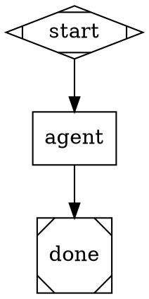

# Using Kilroy From Another Repo

This guide is for a human or agent using Kilroy as a worker runner in an
ordinary project repository. It is not the Kilroy self-development playbook.

Kilroy's public alpha surface is:

```text
kilroy list | describe <name> | check <name>
kilroy run <workflow> [--input-file KEY=PATH ...] [--label K=V ...] [--sync] [--in-place] [--pretty]
kilroy runs list | show <id> | wait <id>
kilroy status [--logs-root <dir> | --latest] [--watch]
kilroy auth defaults | init | list | check | set | prefer | remove-source | suggest-fix
kilroy policy list | show <class> | resolve <class> | prefer | pin | clear | overrides | explain <run-id>
```

`kilroy run` is async by default. It runs launch validation before detaching; if
validation fails, no worker starts. On success it prints a JSON run handle with
`run_id`, `logs_root`, and `prelaunch`. Use `--sync` only when the caller should
block until the run finishes.

## Current Alpha Status

Fully supported today:

- Discover built-in and local workflow packages with `kilroy list`.
- Inspect workflow inputs, outputs, side effects, and classes with
  `kilroy describe <name> --pretty`.
- Validate a workflow against graph, package, class, auth, and local binary
  checks with `kilroy check <name> --pretty`.
- Launch runs with labels, inspect them later by label, and read collected
  outputs from the run database.
- Launch read-only workflows directly in the source repo with `--in-place` when
  the worker must see uncommitted or untracked files.
- Route agent nodes through policy classes such as `hard_coding`,
  `deep_investigation`, `quick_easy`, and `architectural_critique`.
- Initialize and diagnose auth chains with `kilroy auth init`, `auth list`,
  `auth check`, and `auth suggest-fix`.
- Manage global env-var auth mappings with `kilroy auth set`,
  `auth prefer`, `auth remove-source`, and `auth init --rescan`.
- Override class routing at the global or project level with
  `kilroy policy prefer`, `policy pin`, and `policy clear`.
- Override limited runtime/tool config per project with
  `<project>/.kilroy/config.toml`.

Partially supported today:

- Auth management is env-var based. Kilroy can add, reorder, remove, and
  rescan env sources in global auth config, but it does not store key values,
  rotate keys, or log into providers.
- Policy overrides are class-targeted preferences/pins. They can choose an
  existing policy candidate by model and optional driver, but they do not let a
  downstream repo invent an arbitrary model/provider tuple.

Not supported today:

- There is no `kilroy discover` command. Use `kilroy list`.
- There is no `kilroy policy init/copy/validate` file-management workflow.
  Use `policy prefer`, `policy pin`, `policy clear`, and `policy overrides`.
- A downstream repo cannot define an arbitrary new class fallback chain without
  changing Kilroy itself. Local workflows should choose existing classes and
  use project policy overrides only when the existing chain order is wrong for
  that repo.

## First-Time Setup

Run these from the project where Kilroy will be used:

```bash
kilroy auth init
kilroy auth list --pretty
kilroy auth check --pretty
kilroy list --pretty
kilroy policy list
```

`auth init` writes `~/.config/kilroy/auth.toml` from Kilroy's template and the
credentials detected on the machine. Detected sources are active TOML entries.
Undetected but supported sources are written as comments that can be
uncommented after adding the env var or logging into the CLI tool.

For separate Kilroy budgets, prefer `_KILROY` env vars:

```bash
export ANTHROPIC_API_KEY_KILROY=...
export OPENAI_API_KEY_KILROY=...
export GEMINI_API_KEY_KILROY=...
```

Then rerun:

```bash
kilroy auth init --rescan
kilroy auth check --pretty
kilroy policy resolve hard_coding
```

## Director Workflow

Use Kilroy like a worker pool: write focused task specs, launch one run per
task, tag every run, then integrate results after each run finishes.

1. Write a task file.

```bash
mkdir -p /tmp/kilroy-tasks
$EDITOR /tmp/kilroy-tasks/T-001-investigate-auth.md
```

2. Pick a workflow.

```bash
kilroy list --pretty
kilroy describe investigate --pretty
kilroy check investigate --pretty
```

3. Launch with labels.

```bash
kilroy run investigate \
  --input-file question=/tmp/kilroy-tasks/T-001-investigate-auth.md \
  --label scope=auth \
  --label wave=1 \
  --label task=T-001
```

For a read-only investigation that must inspect the current repo exactly as it
is, including dirty and untracked files, add `--in-place`. In-place workflows
still write their declared outputs and Kilroy metadata in the repo.

```bash
kilroy run investigate \
  --in-place \
  --input-file question=/tmp/kilroy-tasks/T-001-investigate-auth.md \
  --label scope=auth \
  --label wave=1 \
  --label task=T-001
```

For implementation:

```bash
kilroy run implement \
  --input-file prompt=/tmp/kilroy-tasks/T-002-implement.md \
  --input-file verify_command=/tmp/kilroy-tasks/T-002-verify-command.txt \
  --label scope=auth \
  --label wave=1 \
  --label task=T-002
```

4. Survey and wait.

```bash
kilroy runs list --label wave=1 --pretty
kilroy status --latest --watch
kilroy runs wait --latest --label task=T-002 --timeout 1h
```

5. Read the result.

```bash
kilroy runs show --latest --label task=T-002
kilroy runs show --latest --label task=T-002 --outputs
kilroy runs show --latest --label task=T-002 --print result.md
```

6. Integrate code changes manually.

`kilroy runs show` reports `worktree`, `run_branch`, `logs_root`, `outputs`,
and `final_sha` when available. Review the run's worktree or branch before
bringing changes back to the original repo. A typical integration pass is:

```bash
kilroy runs show <run-id>
git show <final-sha>
git cherry-pick --no-commit <final-sha>
git diff
```

Do not blindly merge a run branch. Inspect outputs and the diff first.

## Choosing Workflows

The default `kilroy list` hides experimental workflows. Add `--all` when
you deliberately want test harnesses or exploratory loops.

| Workflow | Use when |
|---|---|
| `investigate` | You need read-only research and a structured `result.md`. |
| `implement` | You have a directed code change and a verification command. |
| `fix` | You have a bug description, expected behavior, and preferably a repro. |
| `review` | You need a structured review of a patch or branch. |
| `coding-relay` | You want a longer experimental planner/coder/critic loop. |
| `build-test` | You want no-LLM build/test verification. Use `--all` to list it. |

Workflow discovery order is:

1. `KILROY_WORKFLOW_PATHS` (colon-separated directories)
2. `<project-root>/.kilroy/workflows/`
3. `$XDG_CONFIG_HOME/kilroy/workflows/`
4. `$XDG_DATA_HOME/kilroy/workflows/`
5. source-checkout `workflows/` for development binaries

The project root is the nearest ancestor with a `.kilroy/` directory. Set
`KILROY_PROJECT_ROOT` to force a root; Kilroy errors if that directory does not
contain `.kilroy/`.

## Authoring Local Workflows

Put local workflows in the project:

```text
.kilroy/workflows/my-workflow/
  workflow.toml
  graph.dot
  prompts/
  scripts/
```

Minimal `workflow.toml`:

```toml
[workflow]
name = "my-workflow"
version = "1"
description = "Do one focused thing."
default_class = "hard_coding"
graph = "graph.dot"

[inputs.prompt]
type = "string"
required = true

[outputs.result]
type = "path"
path = "result.md"
```

Minimal class-routed graph:



Validate before launching:

```bash
kilroy check my-workflow --pretty
```

Use `agent_class`, not raw model IDs, for normal workflows. The validator
rejects raw `llm_model`, `llm_provider`, and `agent_tool` declarations in
`model_stylesheet`. Some legacy node-level raw routing still exists for built-in
exercises, but new workflows should use classes so routing follows Kilroy's
policy recommendations as they change.

## Auth State

Kilroy has two auth layers:

- User config: `~/.config/kilroy/auth.toml`
- Project override: `<project>/.kilroy/auth.toml`

The product auth-management commands write the global user config only. The
resolver still honors a project auth file if one exists, but new setup should
prefer global env-var mappings unless there is a deliberate compatibility need
for project auth.

Project entries replace user entries by binding key or chain name. Source lists
are not merged across layers.

Useful commands:

```bash
kilroy auth defaults
kilroy auth init --force
kilroy auth init --rescan
kilroy auth set openai --env OPENAI_API_KEY_KILROY
kilroy auth prefer openai/api_key OPENAI_API_KEY_KILROY
kilroy auth remove-source openai/api_key OPENAI_API_KEY
kilroy auth list --pretty
kilroy auth list --chains --pretty
kilroy auth check --pretty
kilroy auth doctor --pretty
kilroy auth check --project /path/to/project --pretty
kilroy auth suggest-fix
```

If auth is broken:

1. Run `kilroy auth list --pretty` to see discovered credentials.
2. Run `kilroy auth list --chains --pretty` to see which chains reference them.
3. Set the missing env var or run the provider CLI login flow.
4. Run `kilroy auth init --rescan` to add newly detected template sources.
5. Use `auth set`, `auth prefer`, or `auth remove-source` to map or reorder env
   sources without hand-editing TOML.
6. Run `kilroy auth check --pretty`.

`auth set` and `auth prefer` never store the key value. They store the env var
name Kilroy should read at check/run time.

Current caveat: `opencode` is a separate auth surface. Workflows that route
through opencode may depend on opencode's own config/env behavior rather than
Kilroy's auth-chain materialization.

## Policy State

Policy maps abstract classes to ordered fallback chains of concrete model,
driver, provider, and auth requirements. Workflows should ask for classes:

- `hard_coding`
- `quick_easy`
- `deep_investigation`
- `architectural_critique`
- `frontend_aesthetic`
- tool-specific classes such as `coding_codex_apikey`

Useful commands:

```bash
kilroy policy list
kilroy policy show hard_coding
kilroy policy resolve hard_coding
kilroy policy prefer hard_coding gpt-5 --scope project
kilroy policy pin hard_coding gpt-5 --scope global
kilroy policy clear hard_coding --scope project
kilroy policy overrides --json
kilroy policy explain <run-id>
```

Resolution precedence is:

```text
embedded Kilroy policy < global policy override < project policy override
```

`policy resolve` auto-discovers the nearest `.kilroy/` project root and reports
override provenance as `policy_source` / `override_mode` in JSON output. The
`--project <dir>` flag is still available for tests and scripts.

Override files are hidden implementation state:

- Global: `~/.config/kilroy/policy-overrides.toml`
- Project: `<project>/.kilroy/policy-overrides.toml`

Do not hand-author those files for normal use. Use `policy prefer` when you want
a model moved to the front of a class chain. Use `policy pin` when you want only
that model's matching policy candidates to be considered.

If a local workflow needs a routing setup that no current class or candidate
represents, the alpha answer is still to pick the closest class or change
Kilroy's embedded policy in `internal/policy/data/policy.toml`.

## Config State

General Kilroy config is separate from auth:

- User config: `~/.config/kilroy/config.toml`
- Project override: `<project>/.kilroy/config.toml`

Precedence is:

```text
built-in defaults < user config < project config < environment < CLI flags
```

Current config keys are limited to runtime timeouts/retries, CXDB UI settings,
and selected tool paths. Auth chains and policy classes are not configured in
`config.toml`.

## Run State and Labels

Every run is recorded in Kilroy's local run database. Labels are the main way a
director keeps related worker runs together:

```bash
kilroy run investigate \
  --input-file question=/tmp/T-101.md \
  --label conversation=alpha-docs \
  --label wave=2 \
  --label task=T-101 \
  --label scope=docs

kilroy runs list --label conversation=alpha-docs --pretty
kilroy runs list --label wave=2 --status running --pretty
kilroy runs show --latest --label task=T-101
```

Use stable labels such as:

- `conversation=<slug>`
- `wave=<N>`
- `task=<id>`
- `scope=<area>`

Run artifacts live under `logs_root`. Common files include `manifest.json`,
`prelaunch_validation.json`, `final.json`, `outputs.json`, `progress.ndjson`,
per-stage `prompt.md`, per-stage `response.md`, and collected files under
`outputs/`.

## Legacy And Advanced Surfaces

These commands and flags are real but not the preferred agent-worker path:

- `kilroy run --graph <file.dot>`
- `kilroy run --package <dir>`
- `--config <run.yaml>`
- `--run-id <id>`
- `--logs-root <dir>`
- `kilroy ingest`
- `kilroy resume`
- `kilroy stop`
- `kilroy serve`

Use them for Kilroy development, tests, migration work, or explicit operator
requests. For normal repo worker usage, prefer packaged workflows discovered by
name.
