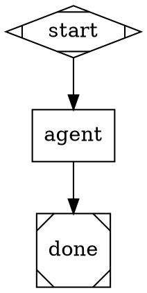

# Using Kilroy

Kilroy is a local worker-runner for software repositories. The normal alpha
surface is packaged workflows by name:

```text
kilroy list | describe <name> | check <name>
kilroy run <workflow> [--input-file KEY=PATH ...] [--label K=V ...] [--sync] [--in-place] [--pretty]
kilroy runs list | show <id> | wait <id>
kilroy status [--logs-root <dir> | --latest] [--watch]
kilroy auth defaults | init | list | check | set | prefer | remove-source | suggest-fix
kilroy policy list | show <class> | resolve <class> | prefer | pin | clear | overrides | explain <run-id>
```

`kilroy run` is async by default. Use `--sync` only when you intentionally want
to block. Async launch runs prelaunch validation first; if validation fails, no
worker is launched. The returned JSON handle includes `prelaunch`.

For the full external-repo guide, read `docs/usage.md`.

## Investigate A Repo Question

When asked to use Kilroy to answer a repo question, do this:

```bash
cd <repo>
printf '%s\n' '<question>' > /tmp/kilroy-question.md
kilroy run investigate \
  --in-place \
  --input-file question=/tmp/kilroy-question.md \
  --label conversation=<slug> \
  --label task=<slug> \
  --label scope=<slug>
```

Then either return the run ID to the user or, if asked to wait:

```bash
kilroy runs wait --latest --label task=<slug> --timeout 1h
kilroy runs show --latest --label task=<slug> --print result.md
```

Use `--in-place` for repo investigation so the worker sees the current working
tree, including uncommitted and untracked files. Use it only for read-only
workflows such as `investigate` and `review`. In-place workflows still write
their declared outputs and Kilroy metadata in the repo.

Do not look for a separate launch workflow. Do not run `kilroy run <name>
--help`; use `kilroy describe <name> --pretty`.

## Worker Pattern

Use Kilroy like a worker pool:

1. Write one focused task/spec file.
2. Pick a workflow with `kilroy list --pretty` and
   `kilroy describe <name> --pretty`.
3. Optionally run `kilroy check <name> --pretty` for validation without launch.
4. Launch with labels for later grouping.
5. Watch or wait by label.
6. Read `result.md` or other declared outputs.
7. Review and integrate code changes manually from the reported worktree,
   run branch, or final SHA.

Example:

```bash
kilroy run investigate \
  --input-file question=/tmp/T-001.md \
  --label conversation=my-session \
  --label wave=1 \
  --label task=T-001 \
  --label scope=auth

kilroy runs list --label wave=1 --pretty
kilroy runs wait --latest --label task=T-001 --timeout 1h
kilroy runs show --latest --label task=T-001 --print result.md
```

Recommended labels:

- `conversation=<slug>`
- `wave=<N>`
- `task=<id>`
- `scope=<area>`

There is no `kilroy discover` command; use `kilroy list`.

## Workflow Discovery

Discovery order:

1. `KILROY_WORKFLOW_PATHS`
2. `<project-root>/.kilroy/workflows/`
3. `$XDG_CONFIG_HOME/kilroy/workflows/`
4. `$XDG_DATA_HOME/kilroy/workflows/`
5. source-checkout `workflows/` for development binaries

The project root is the nearest ancestor containing `.kilroy/`. A non-empty
`KILROY_PROJECT_ROOT` overrides discovery and must point at a directory with a
`.kilroy/` marker.

Use `kilroy list --all --pretty` to include experimental workflows.

## Choosing Workflows

- `investigate`: read-only research, writes `result.md`.
- `implement`: directed code change with build/test verification.
- `fix`: bug fix from issue/repro, emits `result.md` and `fix.patch`.
- `review`: read-only review of a patch or branch.
- `coding-relay`: experimental planner/coder/critic/status loop.
- `build-test`: no-LLM build/test verification, hidden unless `--all`.

Use `kilroy describe <name> --pretty` for exact inputs and outputs.

## Auth

Auth management is env-var based.

Supported:

- `kilroy auth init` generates `~/.config/kilroy/auth.toml`.
- `kilroy auth init --rescan` adds newly detected template sources.
- `kilroy auth set <provider> --env <NAME>` maps a provider API-key chain to
  an env var in global auth.
- `kilroy auth prefer <provider/method[/tool]> <NAME>` moves an env var to the
  front of a global auth chain.
- `kilroy auth remove-source <provider/method[/tool]> <NAME>` removes an env
  source from a global auth chain.
- `kilroy auth list --pretty` shows discovered credentials.
- `kilroy auth list --chains --pretty` shows configured chains and resolution.
- `kilroy auth check --pretty` exits nonzero if any configured chain is broken.
- Project auth files can still live at `<project>/.kilroy/auth.toml`, but the
  management commands intentionally write only global auth.

Not supported:

- No key storage, key rotation, or provider login.

To fix auth, set the provider env var or run the provider CLI login flow, then
use `auth init --rescan`, `auth set`, `auth prefer`, or `auth remove-source`.
Prefer `_KILROY` env vars for Kilroy-specific budgets:
`ANTHROPIC_API_KEY_KILROY`, `OPENAI_API_KEY_KILROY`,
`GEMINI_API_KEY_KILROY`.

Current caveat: opencode remains a separate auth surface.

## Policy

Workflows should use `agent_class`, not raw model IDs. Classes let Kilroy keep
model recommendations current without rewriting local workflows.

Useful commands:

```bash
kilroy policy list
kilroy policy show hard_coding
kilroy policy resolve hard_coding
kilroy policy prefer hard_coding gpt-5 --scope project
kilroy policy pin hard_coding gpt-5 --scope global
kilroy policy clear hard_coding --scope project
kilroy policy overrides --json
kilroy policy explain <run-id>
```

Policy resolution uses:

```text
embedded Kilroy policy < global policy override < project policy override
```

Use `policy prefer` to move an existing model candidate to the front of a class
chain. Use `policy pin` to restrict a class to that model's matching
candidates. `policy resolve --json` reports `policy_source` and
`override_mode`.

If a local workflow needs routing that no class or existing candidate
represents, pick the closest class or change Kilroy itself. There is no
`kilroy policy init/copy/validate` file-management workflow.

## Local Workflow Authoring

Put workflows under `.kilroy/workflows/<name>/` with `workflow.toml` and
`graph.dot`.

Minimal manifest:

```toml
[workflow]
name = "my-workflow"
version = "1"
description = "Do one focused thing."
default_class = "hard_coding"
graph = "graph.dot"

[inputs.prompt]
type = "string"
required = true

[outputs.result]
type = "path"
path = "result.md"
```

Minimal class-routed graph:



Validate before launch:

```bash
kilroy check my-workflow --pretty
```

The validator rejects raw `llm_model`, `llm_provider`, and `agent_tool` in
`model_stylesheet`. Some node-level legacy routing still exists, but new
workflows should use classes.

## Run State

Important commands:

```bash
kilroy runs list --label scope=my-task --pretty
kilroy runs show <run-id>
kilroy runs show <run-id> --outputs
kilroy runs show <run-id> --print result.md
kilroy status --latest --watch
```

`runs show` reports `worktree`, `run_branch`, `logs_root`, `outputs`, and
`final_sha` when available. Inspect the diff and outputs before cherry-picking
or merging any worker result.

## Advanced Surfaces

These are real but not the default worker path: `run --graph`, `run --package`,
`--config`, `--run-id`, `--logs-root`, `ingest`, `resume`, `stop`, and `serve`.
Use them for explicit operator requests, tests, or Kilroy development.
