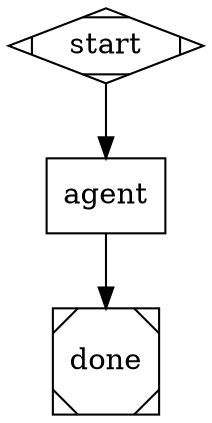

# Using Kilroy

Kilroy is a local worker-runner for software repositories. The normal alpha
surface is packaged workflows by name:

```text
kilroy list | describe <name> | check <name>
kilroy run <workflow> [--input-file KEY=PATH ...] [--label K=V ...] [--sync] [--in-place] [--pretty]
kilroy runs list | show <id> | wait <id>
kilroy status [--logs-root <dir> | --latest] [--watch]
kilroy auth defaults | init | list | check | set | prefer | remove-source | suggest-fix
kilroy policy list | show <class> | resolve <class> | prefer | pin | clear | overrides | explain <run-id>
```

`kilroy run` is async by default. Use `--sync` only when you intentionally want
to block. Async launch runs prelaunch validation first; if validation fails, no
worker is launched. The returned JSON handle includes `prelaunch`.

For the full external-repo guide, read `docs/usage.md`.

## Local Install / Refresh

From a Kilroy checkout, refresh the local demo install with:

```bash
./scripts/install.sh
```

The installer builds `kilroy`, copies it to `~/.local/bin/kilroy`, refreshes
built-in workflows under `$XDG_DATA_HOME/kilroy/workflows`, and installs the
first-party Kilroy skills into:

- `~/.claude/skills`
- `~/.codex/skills`
- `~/.agents/skills`
- `~/.config/opencode/skills`

After install, smoke discovery from a non-Kilroy repo:

```bash
kilroy list --pretty
kilroy describe implement --pretty
kilroy check implement --pretty
```

## Classify The Request

Default to the three public workflows. Do not make the user choose from the
internal station list.

| Request state | Use | Notes |
|---|---|---|
| Raw goal, vague ask, bug report, feature idea, greenfield idea, or risky request | `plan` | Fast intake. Produces status, task packet, testing plan, and validation plan. |
| Task packet is ready and code should be produced | `implement` | Public planner/coder/critic loop. Uses testing and validation plans. |
| A worktree, patch, branch, or run result needs evidence | `validate` | Runs declared validation and writes evidence artifacts. |

Use `kilroy list --all` only when you intentionally need an internal station
workflow such as `investigate`, `fix`, `review`, `build-test`,
`implement-oneshot`, `implement-codex`, or `coding-relay`.

If the user asks for broad autonomous work, do not hand a vague sentence to a
coding worker. First run `plan` to turn the request into a seed/task packet and
to surface clarification, risk, budget, no-op, and validation needs.

## Route To Specific Skills

This skill is the intake and operations guide. If the request is mostly about
one specialized artifact, switch to the narrower skill after classification:

| Need | Skill |
|---|---|
| Turn a goal/spec into acceptance criteria, scenarios, or a Definition of Done | `build-dod` |
| Author or repair a workflow graph/DOT file | `create-dotfile` |
| Author or repair a run config | `create-runfile` |
| Diagnose a stuck, failed, or surprising Kilroy run | `investigating-kilroy-runs` |
| Bootstrap a new project repo for Kilroy/Attractor work | `starting-a-project` |
| Prepare release notes, tags, or publishing | `release-kilroy` |

Use the narrower skill for the specialized work, then come back here to launch,
watch, chain, and inspect runs.

## Make A Session Workspace

Put temporary prompt files and handoff artifacts outside the working branch.
Use one session label for every related run.

```bash
SESSION=<short-slug-or-ulid>
TASK_ROOT="${XDG_STATE_HOME:-$HOME/.local/state}/kilroy/sessions/$SESSION"
mkdir -p "$TASK_ROOT"
```

Recommended labels on every run:

- `session=<same-id-for-the-whole-conversation>`
- `phase=plan|implement|validate`
- `wave=<N>`
- `task=<slug>`
- `scope=<area>`

Do not write transient task files, copied run outputs, or scratch notes into the
repo unless the user or repo conventions explicitly require it.

## Stay In Your Stream

Your stream is the current session label, the run IDs launched for that session,
their reported worktrees, and commits you deliberately integrated. Similar topic
names in other worktrees or branches are not part of your stream.

It is fine to run `git worktree list` once to avoid path or branch collisions.
If you see pre-existing worktrees with similar names, treat them as owned by
another human or agent unless the user explicitly named them as input. Do not
inspect, diff, reuse, or compare unrelated worktrees just because they look
relevant. A similar name is not context.

Only use another stream's work when the user says to continue it, the plan
artifact explicitly names it as authorized source context, or you have already
integrated its commit into your current branch.

## Make A Good Seed

For code-producing work, `plan` should create or refine the task packet. When
you write one manually, put it in the session workspace. Include only facts and
decisions the worker needs:

```markdown
# Task

## Intent
What should become true?

## Source
Where did this come from? User request, bug, ticket, prior run, logs, PR.

## Scope
Repos/files/features in scope.

## Non-goals
What not to change.

## Reproduction / starting evidence
How to observe the bug or current behavior, if applicable.

## Validation
Commands, scenarios, screenshots, logs, or artifacts that prove success.

## No-op / escalation rules
When no code change is the right answer, or when a human must decide.

## Budget / risk
Allowed network, paid tokens, staging/prod deploys, destructive actions.
```

Prefer validation that exercises the delivered behavior from the outside
(CLI/browser/API/logs) over tests that only assert internals. If validation is
unclear, run `plan` and let it produce a validation plan before coding.

## Choose The Work Environment

- **Read current messy repo state:** use `--in-place` only for read-only or
  evidence-collection work when the worker must see dirty or untracked files.
- **Make code changes in a repo:** use the default Kilroy worktree behavior.
  Do not use `--in-place`; inspect and integrate the worker result manually.
- **Continue a previous worker's unintegrated work:** only do this for a run in
  your stream, or a run the user explicitly told you to continue. Launch the
  next worker from that run's reported worktree, or integrate/cherry-pick the
  result first and launch from the main project. Do not accidentally start from
  the original repo if the next run depends on unmerged worker changes.
- **Clean-room experiment or prototype:** create a temporary git repo, put the
  seed/spec there, and run Kilroy from that repo. Use this for technology
  spikes or ground-up experiments that should not touch the product repo.
- **Multiple independent jobs:** write one task packet per job, label each run,
  and launch them separately. Use the same `session` and different `task` or
  `wave` labels.

## Chain Runs Deliberately

Normal chain:

1. `plan` -> `task-packet.md`, `testing-plan.md`, `validation-plan.md`
2. `implement` -> `result.md`, `STATUS.md`, `implementation.patch`
3. integrate or continue from the reported worktree
4. `validate` -> `evidence.md`, `evidence.json`
5. if validation fails, feed `evidence.md` and the prior result back into
   another `implement` run from the same work environment

After every run, read the outputs before deciding the next run:

```bash
kilroy runs show --latest --label session=<session> --outputs
kilroy runs show --latest --label phase=plan --print plan-status.json
kilroy runs show --latest --label phase=implement --print result.md
kilroy runs show --latest --label phase=validate --print evidence.md
```

Treat `result.md`, patches, build reports, review JSON, logs, and screenshots
as evidence. Do not chain another coding worker just because the prior worker
claimed success; check whether the evidence supports the next step.

## Wait For Runs Calmly

After launching an async run, capture the `run_id` and wait for the terminal
state. Do not tight-poll `runs show`, `runs list`, `status`, or local repo
state while the worker is running.

Preferred pattern:

```bash
RUN_ID=<id-from-kilroy-run-output>
kilroy runs wait "$RUN_ID" --timeout 30m --interval 60s --json
kilroy runs show "$RUN_ID" --outputs
```

Notes:

- `kilroy runs wait` does not support `--pretty`; use plain output or `--json`.
- Use `--interval 30s` for quick `plan` runs and `--interval 60s` or longer
  for `implement` runs.
- Use `kilroy run <workflow> --wait` when you want launch-and-block in one
  command, but still avoid separate status polling loops.
- Use `kilroy status --logs-root <dir> --watch` only for human-facing live
  monitoring, not as an agent's background loop.
- If the wait times out, report that the run is still running with its `run_id`
  and `logs_root`, then wait again with a longer timeout or move to genuinely
  independent work.

While waiting, do not locally inspect, research, or implement the same phase the
Kilroy worker is doing. If more help is useful, launch another clearly separate
Kilroy run with the same `session` label; otherwise let the worker finish and
inspect its outputs once.

## Run Plan

```bash
cd <repo>
printf '%s\n' '<goal>' > "$TASK_ROOT/goal.md"
kilroy run plan \
  --input-file goal="$TASK_ROOT/goal.md" \
  --label session=<session> \
  --label phase=plan \
  --label wave=1 \
  --label task=<slug> \
  --label scope=<slug>
```

If `plan-status.json` is `NEEDS_CLARIFICATION`, ask the user the generated
questions, write answers to `$TASK_ROOT/clarifications.md`, and rerun:

```bash
kilroy run plan \
  --input-file goal="$TASK_ROOT/goal.md" \
  --input-file clarifications="$TASK_ROOT/clarifications.md" \
  --label session=<session> \
  --label phase=plan \
  --label wave=2 \
  --label task=<slug> \
  --label scope=<slug>
```

If the user explicitly says not to ask questions, or says to use good judgment,
include that in the `goal` or `clarifications` input so `plan` can proceed.

`plan-status.json` is authoritative. Do not feed `task-packet.md`,
`testing-plan.md`, or `validation-plan.md` into `implement` unless the status
is `READY_TO_IMPLEMENT`. For non-ready statuses, those files may be partial or
placeholder artifacts for human review only.

## Run Implement

Copy the plan outputs to the session workspace if needed. Also write a
project-appropriate verify command from the testing plan or package scripts.
For JavaScript repos, prefer an existing script such as `turbo:check`, `check`,
`typecheck`, `lint`, or `test`; never invent an npm script name.

Example:

```bash
printf '%s\n' 'npm run turbo:check 2>&1' > "$TASK_ROOT/verify-command.txt"
```

If the isolated Kilroy worktree will need dependency installation, database
setup, emulator startup, or other environment preparation, make that explicit
with `setup_command` only when the user, task packet, or project rules authorize
that work. Do not silently run networked setup because a repo looks like
JavaScript.

Then launch:

```bash
kilroy run implement \
  --input-file task_packet="$TASK_ROOT/task-packet.md" \
  --input-file testing_plan="$TASK_ROOT/testing-plan.md" \
  --input-file validation_plan="$TASK_ROOT/validation-plan.md" \
  --input-file verify_command="$TASK_ROOT/verify-command.txt" \
  --label session=<session> \
  --label phase=implement \
  --label wave=3 \
  --label task=<slug> \
  --label scope=<slug>
```

`implement` should be hard to exit. A success with an empty implementation
patch is a Kilroy failure unless the run produced an explicit `.kilroy/no-op.md`
with evidence.

## Run Validate

`validation_command` may contain multiple lines. Kilroy runs it as a shell
script and fails on the first failing command unless the script handles that
failure explicitly.

```bash
kilroy run validate \
  --input-file task_packet="$TASK_ROOT/task-packet.md" \
  --input-file validation_plan="$TASK_ROOT/validation-plan.md" \
  --input-file validation_command="$TASK_ROOT/validation-command.txt" \
  --label session=<session> \
  --label phase=validate \
  --label wave=4 \
  --label task=<slug> \
  --label scope=<slug>
```

`validate` returns `PR_READY` or `FAILED_VALIDATION` in `evidence.json`.
Failed validation is not the end of the factory line; pass `evidence.md` back
into `implement` as context and continue in the same work environment.

## Kilroy-First Means Kilroy-First

If the user explicitly says Kilroy must be used for research, planning,
implementation, or validation, do not do that phase locally while waiting for a
run. Launch another Kilroy run for side research or follow-up work, wait for the
outputs, then inspect and integrate. Local work is for orchestration,
verification, and integration unless the user relaxes the constraint.

There is no `kilroy discover` command; use `kilroy list`. Do not run
`kilroy run <name> --help`; use `kilroy describe <name> --pretty`.

## Workflow Discovery

Discovery order:

1. `KILROY_WORKFLOW_PATHS`
2. `<project-root>/.kilroy/workflows/`
3. `$XDG_CONFIG_HOME/kilroy/workflows/`
4. `$XDG_DATA_HOME/kilroy/workflows/`
5. source-checkout `workflows/` for development binaries

The project root is the nearest ancestor containing `.kilroy/`. A non-empty
`KILROY_PROJECT_ROOT` overrides discovery and must point at a directory with a
`.kilroy/` marker.

Use `kilroy list --all --pretty` to include experimental workflows.

## Choosing Workflows

- `plan`: fast intake, clarification, task packet, testing plan, validation plan.
- `implement`: public planner/coder/critic/status coding loop.
- `validate`: evidence collection against the task packet and validation plan.

Internal station workflows are hidden from default discovery. Use
`kilroy list --all --pretty` only when you deliberately need one.

Use `kilroy describe <name> --pretty` for exact inputs and outputs.

## Auth

Auth management is env-var based.

Supported:

- `kilroy auth init` generates `~/.config/kilroy/auth.toml`.
- `kilroy auth init --rescan` adds newly detected template sources.
- `kilroy auth set <provider> --env <NAME>` maps a provider API-key chain to
  an env var in global auth.
- `kilroy auth prefer <provider/method[/tool]> <NAME>` moves an env var to the
  front of a global auth chain.
- `kilroy auth remove-source <provider/method[/tool]> <NAME>` removes an env
  source from a global auth chain.
- `kilroy auth list --pretty` shows discovered credentials.
- `kilroy auth list --chains --pretty` shows configured chains and resolution.
- `kilroy auth check --pretty` exits nonzero if any configured chain is broken.
- Project auth files can still live at `<project>/.kilroy/auth.toml`, but the
  management commands intentionally write only global auth.

Not supported:

- No key storage, key rotation, or provider login.

To fix auth, set the provider env var or run the provider CLI login flow, then
use `auth init --rescan`, `auth set`, `auth prefer`, or `auth remove-source`.
Prefer `_KILROY` env vars for Kilroy-specific budgets:
`ANTHROPIC_API_KEY_KILROY`, `OPENAI_API_KEY_KILROY`,
`GEMINI_API_KEY_KILROY`.

Current caveat: opencode account/session storage is still a separate surface.
For env-key routes, Kilroy prelaunch and run-config auto-detection both honor
`_KILROY` variants before canonical provider env vars.

## Policy

Workflows should use `agent_class`, not raw model IDs. Classes let Kilroy keep
model recommendations current without rewriting local workflows.

Useful commands:

```bash
kilroy policy list
kilroy policy show hard_coding
kilroy policy resolve hard_coding
kilroy policy prefer hard_coding gpt-5 --scope project
kilroy policy pin hard_coding gpt-5 --scope global
kilroy policy clear hard_coding --scope project
kilroy policy overrides --json
kilroy policy explain <run-id>
```

Policy resolution uses:

```text
embedded Kilroy policy < global policy override < project policy override
```

Use `policy prefer` to move an existing model candidate to the front of a class
chain. Use `policy pin` to restrict a class to that model's matching
candidates. `policy resolve --json` reports `policy_source` and
`override_mode`.

If a local workflow needs routing that no class or existing candidate
represents, pick the closest class or change Kilroy itself. There is no
`kilroy policy init/copy/validate` file-management workflow.

## Provider Smoke Checks

Before a demo, check auth and policy in this order:

```bash
kilroy auth init --rescan
kilroy auth list --pretty
kilroy auth list --chains --pretty
kilroy auth check --pretty
kilroy policy resolve hard_coding
kilroy policy resolve coding_codex_apikey
```

For opencode-routed local workflows, set `agent_tool="opencode"` and an
explicit `llm_provider` on the node. Prelaunch validates the provider key and
run-config auto-detection adds the provider when either the canonical env var
or the `_KILROY` budget-isolated variant is present, for example
`KIMI_API_KEY_KILROY` before `KIMI_API_KEY`.

## Local Workflow Authoring

Put workflows under `.kilroy/workflows/<name>/` with `workflow.toml` and
`graph.dot`.

Minimal manifest:

```toml
[workflow]
name = "my-workflow"
version = "1"
description = "Do one focused thing."
default_class = "hard_coding"
graph = "graph.dot"

[inputs.prompt]
type = "string"
required = true

[outputs.result]
type = "path"
path = "result.md"
```

Minimal class-routed graph:



Validate before launch:

```bash
kilroy check my-workflow --pretty
```

The validator rejects raw `llm_model`, `llm_provider`, and `agent_tool` in
`model_stylesheet`. Some node-level legacy routing still exists, but new
workflows should use classes.

## Run State

Important commands:

```bash
kilroy runs list --label scope=my-task --pretty
kilroy runs show <run-id>
kilroy runs show <run-id> --outputs
kilroy runs show <run-id> --print result.md
kilroy status --latest --watch
```

`runs show` reports `worktree`, `run_branch`, `logs_root`, `outputs`, and
`final_sha` when available. Inspect the diff and outputs before cherry-picking
or merging any worker result.

## Advanced Surfaces

These are real but not the default worker path: `run --graph`, `run --package`,
`--config`, `--run-id`, `--logs-root`, `ingest`, `resume`, `stop`, and `serve`.
Use them for explicit operator requests, tests, or Kilroy development.
